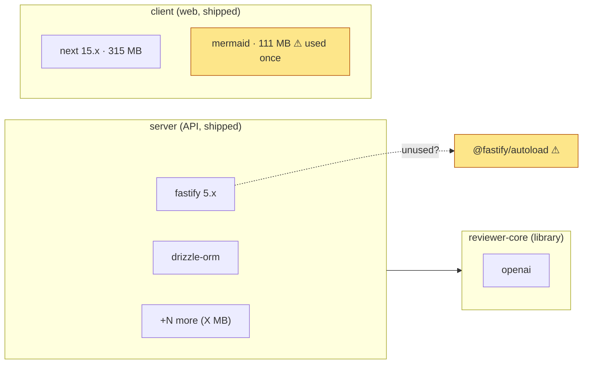
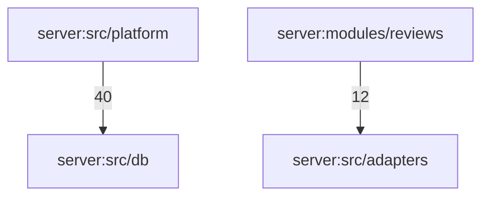

# Report template

Sections in this order. Omit a section only when it would be empty, and say
"none found" in its place for the sections marked **required**.

---

## 0. Summary (required)

Three to five lines at the top:

- Installed total: `<sum of workspaces[].totalInstalledBytes>` across `<N>` workspaces.
- Findings: `P0 <n> · P1 <n> · P2 <n> · P3 <n>`.
- Stale installs: list the workspaces whose `missing-install` count is above zero, or write "none".
- The one thing to do first (the top P0, or the top P1 if there is no P0).

Example:

> Installed: 1.48 GB across 6 workspaces. Findings: P0 3 · P1 4 · P2 3 · P3 2.
> Stale install in `reviewer-core/` (9 dev packages missing) and `e2e/` (3): run `npm ci` there before trusting any number below for those packages.
> First step: resolve the dual lockfile in `mcp/`.

---

## 1. Schema (required)

Two Mermaid diagrams, then the text tree fallback.

### 1a. Packages and their key dependencies

Show each workspace as a subgraph. Show only the top 4–6 dependencies per
workspace by `closureBytes` (plus any flagged item), and collapse the rest into
one node "+N more (X MB)".



Rules for the graph:

- Solid arrow = declared dependency between workspaces. Dashed = a flagged edge.
- Put the size in the node label (`name · closure`) only for the top items.
- Mark flagged nodes with the `flag` class and a `⚠` label; never color by hand-picked hue alone (the label must say what the issue is).

### 1b. Internal component graph

From `workspaces[].internalEdges`. Nodes are server modules, client folders,
and other `src/` groups. Keep the top 25 edges by import count. Mark any edge
that appears in `crossPackageEdges` with a bold style.



Below the graph, one line: `Showing 25 of 99 edges; full list in the scratch JSON.`

### 1c. Text tree (always include; renders everywhere)

```
dev-digest
├── server      214.7 MB  ← API
│   ├── fastify ^5.2.0          own 1.1 MB  closure 14.2 MB  runtime
│   └── ...
├── client      602.8 MB  ← web
└── ...
```

---

## 2. Inventory per workspace (required)

One table per workspace, sorted by `closureBytes` descending, top 10. Then one
line for the rest: `+N packages (X MB) not shown`.

| Dependency | Kind | Version | Own | Closure | Transitive | Imported by | Notes |
|---|---|---|---:|---:|---:|---:|---|
| next | runtime | 15.5.19 | 132.8 MB | 314.6 MB | 49 | 24 files | framework |
| mermaid | runtime | 11.15.0 | 72.6 MB | 110.7 MB | 108 | **1 file** | ⚠ heavy, used once |

Column rules:

- `Kind`: `runtime` (in `dependencies`) or `dev` (in `devDependencies`). Dev weight does not ship, so say which one.
- `Version`: the installed version. If it is `null`, write `not installed` and do not show a size.
- `Own` and `Closure` come from `ownBytes` and `closureBytes`. Show `—` when the value is 0 because the package is not installed.
- `Imported by`: `importingFiles`. Write `0` in bold when the value is zero and the package is not tooling.
- `Notes`: one short phrase, or empty. Put the reasoning in section 5, not here.

---

## 3. Size breakdown (required)

Two small tables.

**By workspace**, with the shipped flag from reference/prioritization.md §1:

| Workspace | Ships? | Installed | Own-sum of direct deps | Share of total |
|---|---|---:|---:|---:|

**By kind** (runtime vs dev, across all workspaces, own bytes of direct deps):

| Kind | Packages | Own size |
|---|---:|---:|

One sentence on what dominates the total: a single heavy dependency, dev tooling,
or many small ones.

---

## 4. Health findings (required)

A flat list, one line per finding, grouped by kind. Each line: the finding, the
workspace, and the evidence (the `problems` entry or the field value).

- **Dual lockfile** — `mcp/`: `pnpm-lock.yaml` and `package-lock.json` are both tracked.
- **Stale install** — `reviewer-core/`: 9 declared dev packages are absent from `node_modules`.
- **Duplicate versions** — `reviewer-core/`: `esbuild` 0.28.0 and 0.21.5 (+9.4 MB).
- **Range drift** — `zod`: `^3.24.1` in three workspaces, `^3.25.76` in `mcp/`.
- **Phantom import** — `<pkg>`: `<name>` imported but not declared.
- **Unused candidate** — `server/`: `@fastify/autoload` (0 importing files). Verified: only mentioned in a comment.
- **Cross-package edge** — `reviewer-core/test/…` imports `server/src/adapters/…`.
- **Audit** (only with `--audit`): counts by severity per workspace, then the high and critical items.

Mark each one `verified` (you ran the check in reference/prioritization.md §4)
or `candidate` (the heuristic fired but you have not checked).

---

## 5. Priorities (required)

One table. Ordered P0 first, then by `closureBytes` or impact inside each level.

| # | Priority | Finding | Why it matters | Effort | Status |
|---|---|---|---|---|---|
| 1 | P0 | dual lockfile in `mcp/` | two sources of truth; CI and local can resolve different trees | S | verified |
| 2 | P1 | `mermaid` in `client/` · 111 MB closure, 1 importing file | largest single cost in the shipped web app | M | candidate |

Effort: `S` under 30 min, `M` a few hours, `L` a day or more.

Explain each P0 and the top two P1 in one sentence each, after the table.

---

## 6. Advice (required)

Numbered, in priority order. Each item has the same four lines:

1. **Action** — what to change, in one sentence.
2. **Where** — the file or package.
3. **Why** — the number that justifies it, from the JSON.
4. **Check** — one command that proves it worked.

Example:

> 1. **Remove the dual lockfile in `mcp/`.** Keep `package-lock.json` (CLAUDE.md names npm for `mcp/`) and delete `pnpm-lock.yaml` in a separate commit.
>    - Where: `mcp/pnpm-lock.yaml`
>    - Why: both files are tracked; `mcp/` installs resolve through two different managers.
>    - Check: `git ls-files mcp | grep -c lock` returns 1.

Do not recommend a dependency swap or a version upgrade without the reason in
the data. A package that is heavy but used is a finding only when the import
pattern suggests it could load lazily.

---

## 7. Method and limits (required)

Three to six lines:

- Date and commit of the scan (`git rev-parse --short HEAD`, the collector's `generatedAt`).
- Workspaces scanned, and any skipped (for example, a workspace with no `node_modules`).
- Measured: installed size (`du -sb`), closure via `pnpm ls` / `npm ls --long`, import counts from source files.
- Not measured: client bundle size, CVEs (unless `--audit`), outdated versions, licenses.
- Heuristics: unused and phantom findings come from regex import scanning, so they are candidates until verified.
