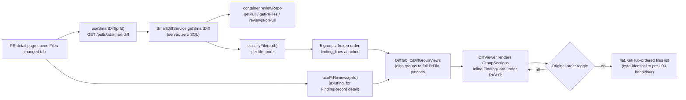

# L03 — Smart Diff (HW3)

Cross-package spec. Implementation plan: `plans/L03-smart-diff.md`. This file
is the binding contract for the *shape* of the feature, per root `AGENTS.md`'s
"write the spec first" rule. Sibling to `specs/L03-intent-layer.md` (the other
half of L03) — see that file for the intent classifier; the two features are
independent and share no code.

Package-local detail: `server/specs/L03-smart-diff.api.md` (route, response
invariants, the frozen classification algorithm, the full path→role table)
and `client/specs/L03-smart-diff.ui.md` (the Files-changed tab, the group dot,
the inline `FindingCard`, the order toggle).

## This feature is wiring, not greenfield

The contracts and i18n keys already exist, unused, before this plan:

| Asset | Location | State before L03 |
|---|---|---|
| `SmartDiffRole` (3-value), `SmartDiffFile`, `SmartDiffGroup`, `ProposedSplit`, `SmartDiff` | `server/src/vendor/shared/contracts/brief.ts:103-135` | exist; `SmartDiffRole` has only `core`/`wiring`/`boilerplate` |
| `SmartDiffResponse` | `server/src/vendor/shared/contracts/review-api.ts:75-76` | exists, aliases `SmartDiff` |
| `smartDiff.*` i18n keys (`coreLabel`, `wiringLabel`, `boilerplateLabel`, `largeTitle`, `largeBody`, `filesCount`, `findingLines`, `groupedByRole`) | `client/messages/en/prReview.json` | exist, unused by any component |
| `server/src/modules/index.ts:24` registry comment | names "intent/smart-diff" as an expected lesson module | not yet registered |

This plan (a) widens `SmartDiffRole` to 5 values, (b) adds the server module
that actually computes a `SmartDiff` from a PR's persisted files and latest
review, and (c) builds the client tab that renders it. No new table, no new
top-level contract, no new namespace file.

## Problem

The Files-changed tab today renders every changed file in GitHub's arbitrary
order, flat, with no signal about which files matter. A PR that touches a lock
file, a snapshot, a config barrel and the one core logic change forces the
reviewer to scroll past noise to find the file that has findings on it. There
is also no way to jump from "this file has findings" to the finding itself —
`FindingCard` only renders in the Findings tab, disconnected from the code it
refers to.

## Scope

1. **Deterministic path classification** — `classifyFile(path): SmartDiffRole`
   is a pure, synchronous, first-match-wins function (frozen algorithm and
   path→role table in `server/specs/L03-smart-diff.api.md`) sorting every
   changed file into exactly one of 5 roles: `core`, `tests`, `wiring`,
   `docs`, `boilerplate`.
2. **One new read route**, `GET /pulls/:id/smart-diff`, grouping a PR's
   persisted `pr_files` by role and attaching each file's finding line
   numbers from the PR's latest review. Always 5 groups, always in the same
   order, empty groups included as `files: []`.
3. **A minimal split-suggestion shape** — `too_big: false`,
   `proposed_splits: []`, `total_lines` summed across every file. No
   splitting heuristic and no LLM call in this plan; the shape exists so a
   later lesson can populate it without a contract change.
4. **Files-changed tab UI** — files rendered grouped by role instead of flat,
   `docs` and `boilerplate` collapsed by default, a per-group dot showing how
   many files in that group have findings, a per-file dot (separate from the
   existing comment-count icon) when that file has findings, and the matching
   `FindingCard` rendered inline directly beneath the offending line.
5. **An "Original order" toggle** reverting to today's flat, GitHub-ordered
   view without a re-fetch — the grouping is purely a display transform of
   data the client already has.

## End-to-end flow

## Acceptance criteria (restated)

- `GET /pulls/:id/smart-diff` returns exactly 5 groups, in the fixed order
  `core, tests, wiring, docs, boilerplate`, for any PR whose files were ever
  fetched — including a PR with zero files (`total_lines: 0`, all groups
  empty).
- Every file in the response carries `finding_lines` sorted ascending and
  deduplicated, sourced from the PR's latest review only.
- The classifier's path→role table (server spec, §"Path → role test table")
  is the contract — `server/test/smart-diff-classify.test.ts` transcribes it
  before any implementation exists and never has a row edited to match the
  code.
- The Files-changed tab groups files by role, `docs`/`boilerplate` start
  collapsed, a group header shows a dot counting **files with findings**
  (never total findings), a file header shows a separate dot from the
  existing comment-count icon, and the `FindingCard` for a line's finding
  renders directly under that line.
- The "Original order" toggle restores today's flat view without an extra
  network round-trip.
- A Smart Diff fetch failure never breaks the tab — it falls back to the
  existing flat view.

## Out of scope

- Any DB schema change, migration, or seed change — Smart Diff is computed
  per request, nothing is persisted (see `server/specs/L03-smart-diff.api.md`
  §"DB schema delta").
- A real `split_suggestion` heuristic or any LLM call for Smart Diff.
- `pseudocode_summary` — stays `null` for every file in this plan; the field
  exists in the contract for a later lesson.
- Reusing `classifyFile` inside prompt assembly / `reviewer-core` /
  `run-executor` — that is L08. The function only has to be importable
  standalone from this plan.
- A new e2e flow file (follow-up, not built here).
- Creating the actual GitHub test PR that exercises all four ◆ categories in
  the path→role table — user-owned, outside this plan.
- `FindingCard`'s own behaviour or appearance — it is moved to
  `client/src/components/finding-card/` byte-for-byte (imports rewritten
  only) so the shared `diff-viewer` layer can render it; no restyle, no prop
  change.

See also: `specs/L03-intent-layer.md` (the sibling L03 feature),
`server/specs/L03-smart-diff.api.md`, `client/specs/L03-smart-diff.ui.md`.
