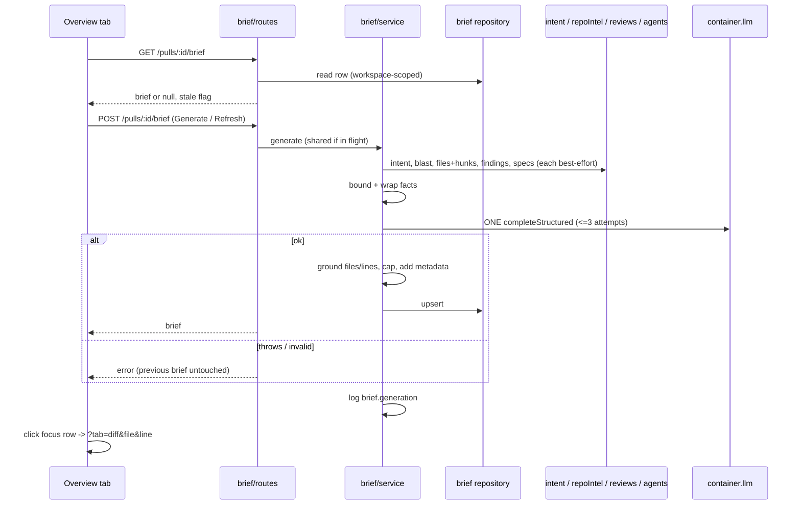

# Spec: PR Why + Risk Brief — one card that tells a cold reviewer what, why, what could break, and where to start
Spec ID: SPEC-08
Status: draft
Supersedes: none

Package refinements: `server/specs/L05c-pr-brief.api.md` (SPEC-09),
`client/specs/L05c-pr-brief.ui.md` (SPEC-10). This file is the source of truth
for scope and behavior. The refinements add package-specific detail and must
not contradict it. No `reviewer-core` refinement is needed: the feature makes
one structured call through the existing `LLMProvider` port and only reuses
`wrapUntrusted` (`reviewer-core/src/prompt.ts:30`); review prompt assembly is
untouched.

**Lesson number.** The file is named `L05c`. Root `README.md:88` lists "PR
Brief card" under **L05**, next to Project Context (`L05`) and the Onboarding
generator (`L05b`). The `c` suffix follows the `L05b` precedent.

## Problem and user

**INSIGHTS entries that apply (loaded this session):**

- `server/INSIGHTS.md` 2026-09-21, feature-model override read. `intent/repository.ts:10-18`
  records that a bare import of `settings/feature-models.ts` trips
  `no-cross-module-imports`, and wrapping it as a `Container` method trips
  `no-circular`. **This conflicts with the assignment text**, which points at
  `resolveFeatureModel(container, workspaceId, 'risk_brief')`. The brief module
  reads the `feature_models.risk_brief` override in its own repository
  (`intent/repository.ts:95-104` is the pattern) and falls back to the
  registry default (`contracts/platform.ts:60`). See SPEC-09 S-3.
- `server/INSIGHTS.md` 2026-09-21, "cross-module data access goes through
  `container.<x>Repo`". Intent, PR files, reviews and agent-attached docs are
  read through `container.intentRepo`, `container.reviewRepo`,
  `container.agentsRepo` and `container.repoIntel`, never through another
  module's files.
- `server/INSIGHTS.md` 2026-09-21, "the response serializer runs `safeParse`
  before `JSON.stringify`". Every `Date` in the brief response is an ISO
  string before it reaches a `response:` schema.
- `server/INSIGHTS.md` 2026-09-21, "a body-less POST arrives as `null`", and
  2026-09-21, "the `vendor/shared` barrel drops a duplicate `export *`".
  `PrBrief` already lives in `contracts/brief.ts`. Extend it there. Do not add
  a second `PrBrief` under another file.
- `server/INSIGHTS.md` 2026-09-30, "`tsc` does not see `server/test/**`".
  Changing `PrBrief` requires an `rg` for it under `server/test/**`.
- `server/INSIGHTS.md` 2026-09-22, "`if (!pr)` seed guard". Any seed data for
  the brief will not appear on an already-seeded dev DB.
- `client/INSIGHTS.md` 2026-09-18, "promote on second consumer". The new cards
  have one consumer (the PR overview). They stay route-local.
- `client/INSIGHTS.md` 2026-09-22, "a shared component's pre-translated
  contract is a docstring". Nothing from this feature is added to the shared
  layer, so all copy goes through `useTranslations("brief")`.
- `client/INSIGHTS.md` 2026-09-17, "`src/vendor/shared` drift". The server
  `brief.ts` is edited first, then copied to the client (they are identical
  today).
- Root, `reviewer-core/` and `e2e/` INSIGHTS: none apply.
- Binding invariants from `AGENTS.md`: routes → service → repository, every
  query scoped by `workspace_id` (`server/AGENTS.md:5-14,24`); enrichment
  degrades instead of failing the request (`server/AGENTS.md:38-40`); all
  PR and repo text is untrusted data.

**Who hits this.** A reviewer who opens somebody else's PR "cold". They do
not know why the change exists, what it can break, or which file to open
first. DevDigest already answers parts of that (Intent, Smart Diff, Blast
Radius). The brief joins them on the Overview tab and adds two model-written
sections: **Risk areas** and **Review focus**.

**What already exists (verified this session).** This is *not* a from-scratch
build, but several details in the assignment text differ from the code:

| Assignment says | Code says |
|---|---|
| `getIntent(prId)` in `reviews/repository.ts` | It moved. `IntentRepository#getIntent(workspaceId, prId)` is at `server/src/modules/intent/repository.ts:55`; the old one was removed (`reviews/repository/pull.repo.ts:46`). The table is `pr_intent` (`db/schema/reviews.ts:87`). |
| `pr_brief` "has `pr_id` and `json`" | Correct, and **nothing else**: no `workspace_id` (violates `server/AGENTS.md:24`) and no writer or reader (rg over `src/`; the only hits are the schema, the barrel and `0000_init.sql:211`). |
| `PrBrief { intent, blast, risks, history }` | Correct (`contracts/brief.ts:137-143`). It has no `summary`, no `review_focus`, and requires `intent`, `blast` and `history`, none of which the brief can guarantee. Nothing imports `PrBrief` today (rg over `server/src` and `client/src`). |
| `GET /pulls/:id/blast` `summary` + callers | `BlastRadiusResponse` extends `BlastRadius` (`review-api.ts:97-105`), so `summary`, `downstream[].callers[]`, `degraded` and `reason` exist. |
| `GET /pulls/:id` has `files[]` with additions/deletions | `PrDetail.files` is `PrFile[]`, and `PrFile.patch` is `nullish` (`platform.ts:218`). Smart Diff roles come from `GET /pulls/:id/smart-diff` (`smart-diff/service.ts`), which classifies by path only. |
| "Specs — the documents you attached to the reviewer" | Docs are attached **per agent, per repo** in `agent_context_docs` (`db/schema/agents.ts:86-101`) and read at the PR's head by `readProjectDocsAtRef` (`reviews/run-executor.ts:12,538-548`). A PR-level brief has no single agent. See AC-9 and OQ-1. |
| `block.risks` label | `client/messages/en/brief.json` says "Risks", and the design says "Risk areas". Only `BlastRadiusCard.tsx:33` reads the `brief` namespace today. |
| `VerdictBanner` visible on the "Agent runs" tab | It is rendered by `FindingsTab` (tab key `findings`). Its props are `verdict, summary, score, findingsCount, blockers, agentName`, with `verdict` required. |
| Overview shows Intent and Blast | Already true. `page.tsx` renders `IntentCard` and `BlastRadiusCard` side by side under `tab === "overview"`, above the PR description (`OverviewTab`). |
| Navigate to a file on "Files changed" | Not present. The tab key is `diff`. `page.tsx` has only `setParam` (`router.replace`). `DiffTab` has no file/line params, and `FileCard` collapses large files (`AUTO_EXPAND_MAX_LINES`). |
| Feature model `risk_brief` | Present (`contracts/platform.ts:18,60`; `client/src/lib/feature-models.ts:29`). |

**Design inputs analyzed (all five read this session):**

- `/tmp/claude-1000/-home-olena-projects-dev-digest-olena/a69f7dfe-ac15-4334-8ca4-157378210d32/images/1.png` (Overview, full)
- `.../images/2.png` (Files changed, "Smart order")
- `.../images/3.png` (Overview, PR Brief highlighted)
- `.../images/4.png` (Overview scrolled; Risk areas and Review focus highlighted)
- `.../images/5.png` (Files changed after a click: the `webhooks.ts` card is outlined, its finding cards open)

Figma links: none. The mock content (`acme/payments-api`, rate limiting, Stripe)
is placeholder data for structure only. Images 3–5 carry a "Made with Claude
Design" chip and a "Back" button in a wrapper bar that is not part of the app.

| Image | Shows |
|---|---|
| 1, 3 | Tabs Overview / Agent runs 7 / Files changed 9. **PR BRIEF** section label. A card with a verdict icon, "**Request changes**" in the verdict color, badge "6 findings · 2 blockers", an info icon, the brief **summary** paragraph, a **refresh** icon button top-right, a **CircularScore** ("61", "PR SCORE") and a cost line "$0.014 8.2K→1.3K". Below: a two-column row. Left panel: **INTENT** (quote, IN SCOPE / OUT OF SCOPE lists), a divider, then **RISK AREAS** (three collapsible rows, each with an icon, a title, a mono `path:lines` link and a chevron). Right panel: **BLAST RADIUS** and "Prior PRs touching these files 3". Below: full-width **REVIEW FOCUS — READ THESE FIRST** with a count badge (4), then rows `▸ path:line — reason`, with the `path:line` as a blue mono link. |
| 2 | **Files changed** with "REVIEWER-ORDERED DIFF", a "Smart order / Original order" toggle, role groups (Core logic, Wiring, Boilerplate), collapsed and expanded file cards, and per-line severity tags (blocker / warning / suggestion). |
| 5 | Same tab after a click on a Review-focus row: the target file card is outlined in blue and expanded, with its finding cards open under the line. |

The mock's Risk areas icons differ per risk (shield, package, bolt). Severity is
shown by icon color. The mock has **no** empty, generating, stale, error or
"no verdict yet" state, and the risk rows show `path:12-18` line ranges, which
the contract's `file_refs: string[]` can carry only as text (AC-19).

## Goals / Non-goals

**Goals**

1. Show one **PR Brief** on the Overview tab: a summary of what the PR does and
   why, **Risk areas**, and **Review focus**, next to the existing Intent and
   Blast radius cards (AC-1, AC-2, AC-25 to AC-38).
2. Make **exactly one logical LLM call** per generation, fed only
   pre-computed facts, never the code itself (AC-5 to AC-11).
3. Cache the brief per PR and head SHA so a reload shows it with no LLM call
   (AC-13 to AC-17).
4. Make every `file` and `line` the model returns verifiable against the PR's
   real files and hunks, so a click never lands on a file that is not in the
   PR (AC-18 to AC-22).
5. Let a click on a Review-focus (or Risk) item open that file on the Files
   changed tab, expanded, scrolled into view and highlighted (AC-39 to AC-44).
6. Degrade honestly when Intent, Blast radius, specs or a review are missing
   (AC-23, AC-24, AC-35).

**Non-goals (explicitly deferred)**

- **Reading the diff code in the prompt.** The model gets hunk *line ranges*
  and stats, not code (AC-6, AC-7).
- **Auto-generation** on PR open, sync, or review run (AC-3).
- **Re-deriving Intent or recomputing Blast radius** from the brief. The brief
  reads what exists (AC-8) and never triggers Intent derivation, an index build
  or a review.
- **The "Prior PRs touching these files" panel.** It exists (`PrHistory`,
  `pr-history` module) and is not part of the brief. The `history` field in
  `PrBrief` becomes optional and this feature writes nothing to it (AC-2).
- **Streaming** the brief token by token. Generation is a single request.
- **A brief for a repo without a clone or index** beyond what AC-23/24 already
  degrade to.
- **Editing or dismissing** individual risks, and exporting or posting the
  brief to GitHub.
- **Persisting a history of briefs.** One current brief per PR (AC-1).
- **Seed data** for PR #482. The seed guard (`db/seed.ts:172`) makes it
  invisible on an existing DB anyway. A demo brief comes from clicking
  Generate.

## User stories

- **US-1** As a reviewer opening an unfamiliar PR, I want a short "what and
  why", the risks and the files to read first, so I can start reviewing without
  asking the author.
- **US-2** As that reviewer, I want each risk tied to a file and each
  review-focus item tied to a line, and one click to jump there, so I don't
  hunt for it in a 9-file diff.
- **US-3** As that reviewer, I want the brief to survive a reload and to tell
  me plainly when the PR has changed since it was written, so I don't trust a
  stale brief.
- **US-4** As an operator, I want each generation's model, tokens and cost
  persisted and logged, so I can verify the "one call" claim and budget the
  feature.
- **US-5 (verification path)** As the feature owner, I open the seeded PR
  #482, see "Generate brief", click it, and after the wait I see the summary,
  Risk areas and Review focus. I reload and see the same brief with no new LLM
  call. I click a Review-focus row and land on that file. I click refresh and
  get a new brief with a new `generated_at`.

## Acceptance criteria (EARS)

Scope and identity

1. [Ubiquitous] The system shall hold at most one current brief per pull request, scoped to its workspace.
2. [Ubiquitous] The system shall define the stored brief as `PrBrief` extended with `summary: string` and `review_focus: { file: string, line: number, reason: string }[]`. `intent` and `blast` shall be nullable, and `history` shall default to `[]`, so a brief can exist without them. `Risk`, `Risks`, `Intent` and `BlastRadius` stay unchanged.
3. [Ubiquitous] The system shall start a generation only on an explicit user action (Generate or Refresh), and never when a PR is read, listed, synced, opened, or reviewed.
4. [Event-driven] WHEN a brief is requested for a PR that has none, the system shall answer with "no brief" and the current PR `head_sha`, and shall make no LLM call.

The single model call

5. [Ubiquitous] The system shall make exactly one logical `completeStructured` call per generation, with `maxRetries` = 2, so a generation performs at most three completions.
6. [Ubiquitous] The system shall build the model input only from pre-computed facts: the PR title and description (at most 4,000 characters, the same number as `MAX_PR_DESCRIPTION_CHARS`, `reviewer-core/src/prompt.ts:47`), the stored Intent, a Blast radius summary (its `summary`, changed-symbol names and caller *files*, no code), diff statistics per file (path, additions, deletions, Smart Diff role), hunk line ranges per file, prior finding locations, and attached spec documents.
7. [Ubiquitous] The system shall not read or send any diff line content or patch text to the model.
8. [Ubiquitous] The system shall read Intent, Blast radius, files, reviews and specs without triggering derivation, indexing or a review, and shall never fail the generation because one of them is absent (AC-23, AC-24).
9. [Ubiquitous] The system shall take "attached specifications" to be the project-context documents attached to any **enabled agent** for the PR's repo, de-duplicated by path, read at the PR head SHA, and bounded by the existing project-context per-doc and total token budget. See OQ-1.
10. [Ubiquitous] The system shall bound the facts payload at 24,000 characters (per-component caps in SPEC-09 S-8). IF it still exceeds that, THEN it shall drop components in this order until it fits: specs, hunk ranges beyond 3 per file, prior finding locations, caller files, the file list beyond the 60 files with the most changed lines. It shall record which components were dropped in `data_gaps`.
11. [Ubiquitous] The system shall request at most 3,000 output tokens, and shall resolve the model from the workspace's `feature_models.risk_brief` setting, falling back to the registry default (`contracts/platform.ts:60`), never from a module constant.

Output contract and validation

12. [Ubiquitous] The system shall ask the model for only `summary`, `risks` and `review_focus`. The system shall copy `intent` and `blast` from the stored facts, so the model cannot alter them.
13. [Ubiquitous] The system shall store on the brief the head SHA it was generated for (`head_sha`), plus `provider`, `model`, `tokens_in`, `tokens_out`, `cost_usd` and `generated_at`, inside the persisted JSON. `cost_usd` shall be `null`, never `0`, when the provider gave no price.
14. [Event-driven] WHEN the model output passes the schema, the system shall apply AC-18 to AC-22, then persist and return the result.
15. [Unwanted behavior] IF the model call throws, or its output fails the schema after all retries, THEN the system shall persist nothing, keep any previous brief as it was, and answer with an error the client can show. The error text shall not contain provider details or secrets.
16. [Unwanted behavior] IF the PR has zero changed files, THEN the system shall make no LLM call and shall answer with a validation error.
17. [Ubiquitous] The system shall log one line `brief.generation` per generation attempt with `workspace_id`, `pr_id`, `head_sha`, `status` (`ready` | `failed`), `provider`, `model`, `llm_calls`, `tokens_in`, `tokens_out`, `cost_usd`, `facts_chars`, `dropped_components` and `duration_ms`. `llm_calls` shall be the adapter-reported `attempts` on success and `null` (unknown) on a throw.

Grounding (the model cannot invent locations)

18. [Unwanted behavior] IF a `review_focus` item's `file` is not one of the PR's changed files, THEN the system shall drop that item.
19. [Ubiquitous] The system shall keep `Risk.file_refs` as plain strings, each either `path` or `path:line` or `path:start-end`. It shall drop every ref whose path is not a changed file, and keep the risk. A risk left with no ref is rendered without a link.
20. [Ubiquitous] The system shall accept a `review_focus.line` only if it falls inside a hunk of that file on the new side. IF it is outside every hunk and the file has hunks, THEN the system shall move it to the start line of the nearest hunk. IF the file has no hunks (a binary or a truncated patch), THEN the system shall set `line` to 1.
21. [Ubiquitous] The system shall cap the brief at 6 risks and 6 review-focus items, de-duplicate review-focus items by `file:line`, and keep the model's order, which is the recommended reading order.
22. [Ubiquitous] The system shall render every model-written string (summary, risk title and explanation, reason) as plain text with no HTML and no Markdown-driven links, and shall cap each at 600 characters (title 120, reason 240).

Degraded inputs

23. [State-driven] WHILE no Intent exists for the PR, the system shall still generate, with `intent: null`, and shall list `intent` in `data_gaps`.
24. [State-driven] WHILE the Blast radius is degraded (`degraded: true`) or unavailable, the system shall still generate, with `blast: null`, and shall list `blast` in `data_gaps`. WHILE no spec documents are attached, it shall list `specs` in `data_gaps` only if the repo has an enabled agent with attachments that could not be read.

Freshness and refresh

25. [State-driven] WHILE the stored brief's `head_sha` differs from the PR's current `head_sha`, the system shall return it with `stale: true`, and the UI shall say so and offer Refresh. The stale brief stays visible.
26. [Event-driven] WHEN the user clicks Refresh, the system shall regenerate over the current facts and replace the stored brief only on success (AC-15).
27. [Unwanted behavior] IF a generation for the same PR is already running, THEN the system shall share it with the second caller. It shall not start a second generation or make a second LLM call.

Overview tab: what the user sees

28. [State-driven] WHILE no brief exists, the Overview tab shall show a "PR Brief" section with a **Generate brief** button. It shall keep the existing Intent and Blast radius cards and the PR description below it unchanged.
29. [State-driven] WHILE a generation runs, the section shall show a busy state, disable Generate and Refresh, and keep the previous brief visible if there is one.
30. [State-driven] WHEN a brief exists, the section shall show the summary at the top. IF the PR has at least one review, it shall show the latest review's verdict, findings and blocker counts, and PR score using `VerdictBanner`, with the brief summary as the banner text. IF it has no review, it shall show the summary alone, without a verdict or score.
31. [Ubiquitous] The system shall show, when a brief exists, the persisted cost and tokens ("$0.014 8.2K→1.3K"), using the number formatting the L01 run-cost badge already uses.
32. [Ubiquitous] The system shall show **Risk areas** as a list of at most 6 rows. Each row shows a kind icon coloured by severity, the title, and its file links, and can be expanded to show the explanation.
33. [Ubiquitous] The system shall convey severity in text as well as colour (an accessible label such as "High risk"), so the meaning survives without colour.
34. [Ubiquitous] The system shall show **Review focus — read these first** as an ordered list of `file:line — reason` rows with a count badge, in the model's order.
35. [State-driven] WHILE `data_gaps` is non-empty, the section shall say which data the brief was generated without (Intent, Blast radius, specs), using the `unavailable` and `unavailableHint` copy style.
36. [State-driven] WHILE the brief has zero risks, the section shall show "No notable risks flagged." (`brief.noRisks`). WHILE it has zero review-focus items, the section shall hide the Review focus card.
37. [Unwanted behavior] IF loading or generating the brief fails, THEN the section shall show an error with Retry, and shall keep the previous brief visible. It shall not break the Intent, Blast radius or Description cards.
38. [Ubiquitous] The system shall lay out the Overview as: brief card on top, then a row with Intent (and Risk areas under it) on the left and Blast radius on the right, then Review focus full width, then the PR description. It shall stack the row on narrow screens.

Navigation to the diff

39. [Event-driven] WHEN the user clicks a Review-focus row (or a risk's file link), the system shall switch to the Files changed tab and put the target in the URL as `?tab=diff&file=<path>&line=<n>`, using a history entry, so Back returns to the Overview and a reload lands on the same place.
40. [Ubiquitous] The system shall, on arriving with `file` set, expand that file's card (even one collapsed by size, or inside a collapsed Smart Diff group), scroll it into view and highlight it. IF `line` is set and falls inside the file's parsed lines, it shall scroll to that line.
41. [Unwanted behavior] IF the `file` is not in the current PR files (a stale brief after a force-push), THEN the row shall render as plain text, not as a link, and clicking shall do nothing.
42. [Ubiquitous] The system shall drop the highlight when the user clicks elsewhere or changes tab, and shall not re-scroll on unrelated re-renders.
43. [Ubiquitous] The system shall make every row and control keyboard-operable with an accessible name, and shall move focus to the target file card on arrival.
44. [Ubiquitous] The system shall work in both Smart order and Original order, and shall not change the order or grouping the user chose.

Scoping and security

45. [Ubiquitous] The system shall scope every brief read and write to the requesting workspace.
46. [Unwanted behavior] IF the PR id does not belong to the requesting workspace, THEN the system shall answer 404 and do nothing else.
47. [Ubiquitous] The system shall pass every PR- or repo-derived text (title, description, Intent text, file paths, caller names, spec content) to the model only inside `wrapUntrusted(...)` blocks with a separate label each, and the system prompt shall state that the blocks are data, not instructions.
48. [Ubiquitous] The system shall never echo an API key or provider error body to the client or the log line.
49. [Ubiquitous] The system shall rate-limit generation to 10 requests per minute per client, like `POST /pulls/:id/intent`.

Verification (US-5)

50. [Event-driven] WHEN the owner opens seeded PR #482, clicks Generate brief, waits, reloads, clicks a Review-focus row, and then clicks Refresh, the system shall show the brief, show the same brief after reload with no new `brief.generation` log line, land on the target file with it expanded and highlighted, and write exactly one new `brief.generation` line per Generate or Refresh.

## Edge cases

**Missing states (the design shows only the happy path):**

- *No brief yet, generating, error, stale, no review yet, no Intent, no Blast,
  no risks.* Not in any image. AC-28 to AC-37 define them. SPEC-10 gives the
  layout.
- *Review exists but is old.* The verdict and score come from the latest review
  and can predate the PR's latest push. The brief's stale flag (AC-25) does
  not cover this, because the review has its own SHA. Not solved here. See OQ-3.
- *Long risk titles and long paths.* The mock rows are one line. See SPEC-10.

**Corner cases:**

- **Very large PR.** 300 files or a 5,000-line diff. The facts payload is
  capped (AC-10). Hunk ranges are numbers only, so size grows with file count,
  not line count. The brief says which components were dropped.
- **Lockfile-only or docs-only PR.** Smart Diff puts everything in
  `boilerplate` or `docs`. The model may return no risks and few focus items.
  That is valid (AC-36).
- **PR with no body and no Intent.** Title, files and stats only. The
  summary says less. `data_gaps` includes `intent`. This is not an error.
- **Force-push during generation.** The head SHA is captured at the start and
  stored with the brief. After the push, the brief is stale on the next read
  (AC-25). A brief is never written under a newer SHA than it was computed for.
- **Two tabs click Generate.** AC-27.
- **Refresh fails.** The previous brief stays and the error shows (AC-15,
  AC-37).
- **Model invents a file or line.** AC-18 to AC-20.
- **Model returns one giant paragraph, HTML or a Markdown link.** AC-22: plain
  text only.
- **Prompt injection from the PR body or a spec.** All such text is wrapped
  (AC-47). The model can still write a misleading summary. That residual risk
  is accepted and shown by the "AI-generated" framing of the card (SPEC-10),
  as it is for Intent today.
- **Merged or closed PR.** Generation is allowed. Nothing in the brief depends
  on the PR being open.
- **Rename in the diff.** `PrFile.path` is the new path. The file must match
  it, or the item is dropped (AC-18).
- **Same file in two Review-focus rows** (lines 12 and 88). Allowed. The
  de-duplication key is `file:line`.
- **Existing `pr_brief` rows.** No code writes the table. SPEC-09 S-2 must
  confirm it is empty before it adds a NOT NULL `workspace_id`.
- **`prId` vs number.** The route is keyed by PR number. Every API is keyed
  by the row uuid. The client resolves it as `page.tsx` already does.

### Cross-module dependencies

- `brief` (new server module) → `container.intentRepo` (`getIntent`),
  `container.reviewRepo` (`getPull`, `getPrFiles`, `reviewsForPull`),
  `container.repoIntel.getBlastRadius`, `container.agentsRepo` (attached docs,
  as `countAgentsUsingDocs` already is used by `project-context`),
  `container.llm(provider)`, `container.git`/`readProjectDocsAtRef` for spec
  content. It reads the `settings` table in its own repository for the
  `risk_brief` override. It does not import another module's `service.ts` or
  `repository.ts`.
- Smart Diff roles: `classifyFile` is a pure function in `smart-diff/helpers.ts`.
  Whether a brief may import it, or the classifier moves to a shared place, is
  the planner's call under `no-cross-module-imports`. Copying the rules is not
  acceptable, because the roles would drift.
- Client → new `GET`/`POST` brief routes; existing `useBlastRadius`,
  `usePrIntent`, `usePrReviews` and `useSmartDiff` in `lib/hooks/reviews.ts`.
  `DiffTab` gains `file`/`line` handling (AC-39 to AC-44).

## Non-functional requirements

- **Cost:** at most 1 logical call and 3 completions per generation (AC-5).
  Zero calls on every read.
- **Latency:** generation is one request that waits for the model. The UI
  shows a busy state for the whole wait (AC-29). The server sets a per-attempt
  timeout so three attempts fit the request budget. SPEC-09 sets the number.
- **Determinism:** grounding, caps, ordering and stale detection are pure
  functions of the model output and the PR facts (AC-18 to AC-22, AC-25).
- **Security:** AC-22, AC-45 to AC-49.
- **i18n:** all copy goes through `next-intl` (`brief.json`). Model prose is
  in the PR's language as written, and no `{{language}}` variable is added in
  v1.
- **Accessibility:** AC-33 and AC-43. The expandable rows use a button with
  `aria-expanded`. Every icon-only button (Refresh) has an accessible name.

## Inputs and provenance

| Input | Source | Validated today |
|---|---|---|
| PR id on brief routes | URL param | `IdParams` uuid (`_shared/schemas.ts:11`), the pattern used by `/pulls/:id/intent`. Workspace ownership is checked through `getPull(workspaceId, prId)`, which `blast/service.ts` and `smart-diff/service.ts` already rely on. |
| Intent | `pr_intent` via `IntentRepository#getIntent` | Typed row. Rows with `error` set carry an empty `intent`, and shall count as absent (AC-23). |
| Blast radius | `container.repoIntel.getBlastRadius(repoId, paths)` | Typed. Best-effort, as `BlastService` wraps it. |
| Files, stats, patches | `pr_files` via `reviewRepo.getPrFiles` | Typed. `patch` is nullish. |
| Smart Diff roles | `classifyFile(path)` | Pure. |
| Prior findings | `reviewRepo.reviewsForPull` | Typed. |
| Attached specs | `agent_context_docs` + `readProjectDocsAtRef` | Path safety and budget in `platform/project-context`. |
| Feature model | `settings` rows | `FeatureModelChoice.safeParse` (`intent/repository.ts:95-104`). |
| LLM output | Provider | Parsed against the new extraction schema by `completeStructured`. The grounding rules (AC-18 to AC-22) are new. |
| Persisted `pr_brief.json` | DB jsonb | **none found** on read. SPEC-09 requires `PrBriefRecord.safeParse` on read, and a row that fails the parse counts as "no brief". |
| `file` and `line` query params on the diff tab | URL | **none found.** The client shall treat them as untrusted (AC-41). |

## Untrusted inputs

| Field | Boundary crossed | Current server-side validation |
|---|---|---|
| PR title, description | GitHub author → LLM prompt | none found. Must be wrapped (AC-47). |
| Intent text | LLM-derived from PR text → LLM prompt | none found. Must be wrapped (AC-47). |
| File paths, caller names | Repo/PR → LLM prompt and UI | none found. Wrapped in the prompt. Rendered as text. |
| Spec documents | Repo clone → LLM prompt | Path safety and budget only. Must be wrapped (AC-47). |
| LLM output (summary, risks, focus) | LLM (steerable by PR content) → DB → browser | Schema parse only. Grounding and length caps are new (AC-18 to AC-22). |
| `file`, `line` URL params | Browser URL → diff tab | Client-only. Matched against the PR's own files (AC-41). Never used as a selector string or inserted as HTML. |

## Open questions

**Both blocking questions were decided by the user on 2026-09-30 and are
binding: OQ-1 = union of enabled agents' docs (AC-9), OQ-2 = synchronous
POST (AC-29, SPEC-09 S-6).**

- **OQ-1. CLOSED 2026-09-30. Which specs feed the brief?** The assignment says "the documents
  you attached to the reviewer". Documents are attached per agent, and a PR
  can have many agents. AC-9 assumes the **union across enabled agents for the
  repo**. The alternatives are the repo's whole discovered project-context set
  (`listRepoDocs`), or only one chosen agent. This changes cost and relevance.
- **OQ-2. CLOSED 2026-09-30. Synchronous or background generation?** AC-29 and SPEC-09 assume a
  single synchronous `POST` that waits for the model, like `POST
  /pulls/:id/intent`. The alternative is a job and polling (like conventions
  and onboarding). A synchronous call is simpler, and the request fits the
  server's timeout with one bounded call.

**Non-blocking:**

- **OQ-3. [UX proposal]** The banner's verdict and score come from the latest
  review, which may predate the head SHA. Show a small "reviewed at `abc1234`"
  note when it differs from the PR head.
- **OQ-4. [UX proposal]** A quiet "AI-generated from PR facts, not from the
  code" line under the summary, to set trust expectations.
- **OQ-5. [UX proposal]** The Risk row's `path:lines` link could show the
  line range from `file_refs` when present (the mock does), or the bare path.
  AC-19 supports both.
