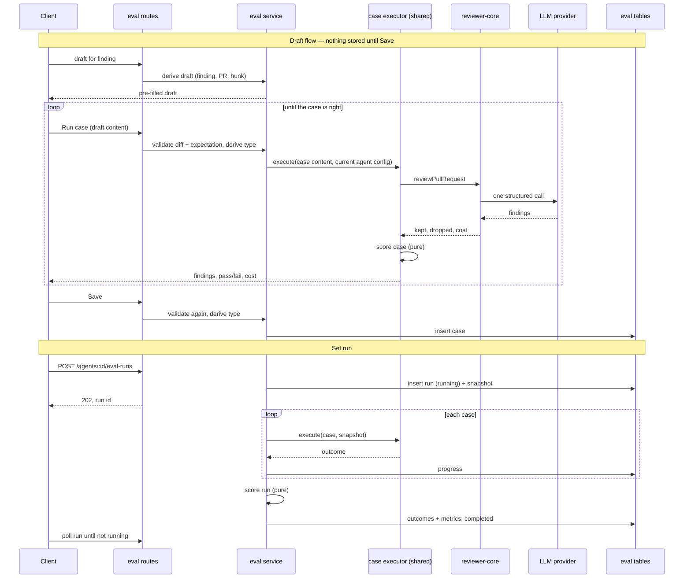

# Spec: Eval Pipeline — regression protection for the product's review agents
Spec ID: SPEC-11
Status: draft
Supersedes: none

Package refinements: `server/specs/L06-eval-pipeline.api.md` (SPEC-12),
`client/specs/L06-eval-pipeline.ui.md` (SPEC-13). This file is the source of
truth for scope, behavior and the scoring definitions. The refinements add
package-specific detail and must not contradict it.

**Not this feature:** this spec covers the *product* eval pipeline — eval
cases and runs for the review agents stored in the `agents` table, built in
`server/` and `client/`. The *harness* eval suite in the root `evals/`
package and its single `.github/workflows/evals.yml` (skills, subagents,
workflow routing) is separate, already in place, and nothing here specifies,
reads or changes it.

No criterion carries a confirmation marker: every question put to the user
is resolved and recorded in "Decisions" at the end.

## Problem and user

**INSIGHTS entries that apply to this task (loaded this session):**

- `server/INSIGHTS.md` 2026-09-21, "cross-module data access must go through
  `container.<x>Repo`". The eval module needs findings (`reviews`), agents and
  skills. It reaches them through `container.reviewRepo` / `agentsRepo` /
  `skillsRepo` (`server/src/platform/container.ts:103-115`), never a sibling
  import.
- `server/INSIGHTS.md` 2026-09-22, "a Service class constructed with
  `container: Container` tripping `no-circular` is expected". If an eval
  Service gets a container getter, add one hand-written baseline entry. Never
  regenerate the baseline.
- `server/INSIGHTS.md` 2026-09-21, "run events (SSE) are never persisted".
  Review-run progress lives in the in-memory `RunBus`. An eval run that must
  survive a page reload cannot rely on it; progress has to be readable from
  the persisted run.
- `server/INSIGHTS.md` 2026-09-21, "`vendor/shared/index.ts` barrel silently
  drops a duplicate `export *` symbol". `EvalRun` / `EvalCase` already exist
  in `contracts/knowledge.ts`; grep `contracts/` before adding any identifier.
- `server/INSIGHTS.md` 2026-09-30, "`tsc` does not see `server/test/**`".
  `test/contracts.test.ts:149` parses `EvalRun`; any change to that contract
  breaks it at runtime only.
- `server/INSIGHTS.md` 2026-09-21, "`fastify-type-provider-zod` response
  serializer strips undeclared keys / rejects `Date`". Applies to every new
  eval route's `response:` schema.
- `server/INSIGHTS.md` 2026-09-21, "a body-less POST arrives as `null`".
  `POST /agents/:id/eval-runs` has no required body.
- `server/INSIGHTS.md` 2026-09-21, "`drizzle-kit generate` needs a pty". A
  new migration is required.
- `server/INSIGHTS.md` 2026-09-21, "an `.it.test.ts` that hand-inserts a
  workspace row fails" — use `seed()` in the eval integration test.
- `server/INSIGHTS.md` 2026-09-17, "reviewing a PR uses OpenRouter by
  default". An eval run resolves the provider named on the agent row.
- `client/INSIGHTS.md` 2026-09-18, "promote on second consumer". The case
  modal is opened from the PR page and from the Agent editor, so it is shared
  from its first change.
- `client/INSIGHTS.md` 2026-09-18, "`next-intl` `{count}` does not format
  numbers" — percentages, deltas and cost are formatted in code.
- `client/INSIGHTS.md` 2026-09-27, "two keys rendering identical text make
  `getByText` ambiguous". The same percentage appears in a metric card and in
  a table row on the same screen.
- `client/INSIGHTS.md` 2026-09-22, "pre-translated, never a literal" — the
  new `FindingCard` button lives in a shared component.
- `client/INSIGHTS.md` 2026-09-18, "hand-rolled severity color map" — case
  rows show a severity badge; use `SeverityBadge`.
- `e2e/INSIGHTS.md` 2026-09-21, "no way to run a single flow". `e2e/AGENTS.md`
  also forbids LLM-dependent flows, so running an eval cannot be an e2e flow.
- `reviewer-core/INSIGHTS.md`: none apply. Root `INSIGHTS.md`: the
  2026-09-30 entry (no `pnpm typecheck -- <flag>`) applies to the plan's
  verification commands only.
- Binding invariants from `AGENTS.md` files: reviewer-core is zero-I/O and
  grounding is mechanical (`reviewer-core/AGENTS.md:7-22`); all external text
  goes through `wrapUntrusted()`; every domain table carries `workspace_id`
  (`server/AGENTS.md:24`); boot-time reaping assumes one API instance
  (`server/AGENTS.md:31-32`); applied migrations are immutable.

**Who hits this:** a user who tunes a review agent — edits its system prompt,
switches its model, or links a skill — and today has no way to tell whether
the agent got better or worse. The only signal is re-running a review on a
live PR and reading the findings by eye.

**What is missing:** a fixed set of cases per agent, built from findings the
user already judged (accept = "this was right", dismiss = "this was noise"),
a way to run the agent over that set, three numbers per run, and a
side-by-side comparison of two runs.

**Why a case is verified before it is saved (course clarification, binding):**
a case in the set is a regression test. A bad case — one that is always red
or always green — is worse than none, because it moves every metric for a
reason unrelated to the agent. So an unverified case must never land in the
set. Clicking "Turn into eval case" therefore writes nothing: it opens a
pre-filled modal where the user runs the draft against the agent, adjusts it
until it is right, and only then saves. "Click creates the case immediately"
is a defect, not a simplification.

**Design input (all six read; in the repo under `specs/assets/L06-eval-pipeline/`):**

| File | Shows |
|---|---|
| `specs/assets/L06-eval-pipeline/1.png` | PR page, Review Runs. Expanded finding with actions Accept / Dismiss / Learn / **Turn into eval case** / Reply to author |
| `specs/assets/L06-eval-pipeline/2.png` | Eval Dashboard index: "Run all agents"; one row per agent (model badge, "Last run v7 · date · 17/20 pass", sparkline, RECALL / PREC / CITE); "Recent eval runs · all agents" table |
| `specs/assets/L06-eval-pipeline/3.png` | Eval Dashboard → agent page: "All agents" back link, agent switcher, "30 days", "Run eval", warning banner, three metric cards with delta and sparkline, Metric trend chart, Recent runs table with checkboxes (2 selected) and "Compare" |
| `specs/assets/L06-eval-pipeline/4.png` | "Compare runs · v6 → v7" modal: four delta cards (recall, precision, citation, cost), system prompt diff with one added line, Close / "Promote v7" |
| `specs/assets/L06-eval-pipeline/5.png` | Agents → Security Reviewer → Evals tab: metric cards + "Traces passed 17/20", "View full dashboard →", "Eval cases 3 / 5 passing", "Run all evals", "New eval case", case rows (pass / fail / never-run icon, name, "expected N finding, got M", severity · category badge or "empty []", run / edit / delete) |
| `specs/assets/L06-eval-pipeline/6.png` | "Eval case · stripe-key-leak" modal: Name, Input tabs Diff / Files / PR meta, Expected output JSON editor with "valid JSON" badge and "Finding skeleton", last-run strip ("Last run passed · expected 1 finding, got 1 · 1.8s · $0.02"), "Run on save" toggle, Cancel / Run case / Save |

**What already exists (verified by opening the files):**

- Tables `eval_cases` and `eval_runs` (`server/src/db/schema/eval.ts:7-35`),
  created in `server/src/db/migrations/0000_init.sql:116,129`. No module
  reads or writes them; `server/src/modules/` has no `eval` folder.
- Contracts `EvalRun`, `EvalPerTrace`, `EvalOwnerKind`, `EvalCase`
  (`server/src/vendor/shared/contracts/knowledge.ts:145-179`) and
  `EvalCaseInput`, `EvalRunRecord`, `EvalRunResult`, `EvalTrendPoint`,
  `EvalDashboard` (`contracts/eval-ci.ts:20-90`). The client copy is in sync.
- Agent versioning: `agents.version` (`server/src/db/schema/agents.ts:45`)
  and immutable `agent_versions` snapshots
  (`server/src/modules/agents/repository.ts:148-167`).
- The decisions: `findings.accepted_at` / `dismissed_at`
  (`server/src/db/schema/reviews.ts:70-71`), set by
  `POST /findings/:id/(accept|dismiss)` (`reviews/routes.ts:195-205`). The two
  are mutually exclusive (`reviews/repository/review.repo.ts:129,142`).
- The grounding gate: `groundFindings` returns `kept` and `dropped`
  (`reviewer-core/src/grounding.ts:52-84`); `reviewPullRequest` returns both
  as `review.findings` and `dropped` (`reviewer-core/src/review/run.ts:101-107,226-230`).
- Client: copy in `client/messages/en/eval.json` — including a `caseEditor`
  namespace with keys for the modal (name, Diff / PR meta tabs, expected
  output, valid / invalid JSON, Run case, Save, last-run strip); the nav label
  `shell.nav.eval` (`client/messages/en/shell.json:24`); the tab label
  `agents.editor.tabs.evals` (`client/messages/en/agents.json:53`); the
  active-key mapping for `/eval` (`client/src/components/app-shell/helpers.ts:35`).
- **Stubs, not features:** the skill-level
  `client/src/components/skill-editor/_components/EvalsTab/EvalsTab.tsx` is a
  placeholder `EmptyState`. The Agent editor has **no** Evals tab: `TABS`
  lists config / skills / context only
  (`client/src/app/agents/[id]/_components/AgentEditor/constants.ts:15-19`),
  and `VALID_TABS` omits it (`client/src/app/agents/[id]/page.tsx:15`). The
  sidebar has **no** Eval Dashboard entry (`client/src/vendor/ui/nav.ts:21-40`)
  and there is no `client/src/app/eval/` route. `FindingCard` renders only
  Accept and Dismiss (`client/src/components/finding-card/FindingCard.tsx:91-112`).
  No case modal component exists.
- `verify:l06` does not exist; no `verify:lNN` script exists on any local
  branch. See "The `verify:l06` gate" below.

### Ready-made schema and contracts — what does not match

The assignment says the schema and Zod contracts are "given ready-made". They
are identical to the course's lab branch (`git diff HEAD
upstream/Lesson-06-lab-finish` is empty for `schema/eval.ts` and
`contracts/eval-ci.ts`). They are not sufficient:

| # | Gap | Evidence | Consequence |
|---|---|---|---|
| G1 | An `eval_runs` row is **one case execution** (`case_id` FK), not one run over the set | `schema/eval.ts:22-35` | Nothing groups the rows of one "Run all". "17/20 pass", run history and compare all need a run-level identity |
| G2 | No agent version, prompt, model or skill snapshot on a run | same | The version column (`3.png`) and the prompt diff (`4.png`) have no source |
| G3 | No run status or error | same | "Running", "failed" and reaping after a restart cannot be represented |
| G4 | `eval_runs` has no `workspace_id` | same; rule at `server/AGENTS.md:24` | Queries can only scope through a join to `eval_cases` |
| G5 | No expectation type anywhere. `must_find` / `must_not_flag` appear in no schema, contract or test | `rg -i "must_find\|must_not_flag"` returns nothing outside `evals/` and `.claude/` | The type must live inside the untyped `expected_output` jsonb / `z.unknown()` (`eval-ci.ts:27`, `knowledge.ts:176`) or in a new field |
| G6 | No link from a case to its source finding, no `created_at` / `updated_at`, no index on owner | `schema/eval.ts:7-20` | Duplicate detection (criteria 10, 28) and "edited between runs" (criterion 67) have nothing to key on |
| G7 | `eval_cases.owner_id` has no FK | `schema/eval.ts:13` | Deleting an agent leaves its cases behind |
| G8 | `EvalRun.recall/precision/citation_accuracy` are non-nullable 0..1 | `knowledge.ts:153-163` | A metric with a zero denominator (criterion 59) cannot be represented |
| G9 | `EvalDashboard.recent_runs` is `EvalRunRecord[]`, a per-case shape with `pass: boolean` and no version | `eval-ci.ts:33-45,68-90` | `2.png` / `3.png` rows show a version and an `X/Y` pass count |
| G10 | No compare contract, no per-agent summary list for the dashboard index | `eval-ci.ts` whole file | `2.png` and `4.png` have no response shape |
| G11 | `EvalCaseInput` has no finding id, and takes `owner_kind` / `owner_id` and an untyped `expected_output` from the client | `eval-ci.ts:20-29` | The save request must carry the source finding and let the server derive owner and type (criteria 12, 25) |
| G12 | `EvalRunResult` requires a `run_id` and a `case_id` | `eval-ci.ts:49-53` | A draft run (criterion 17) has neither: nothing is persisted |
| G13 | No draft / pre-fill shape | `eval-ci.ts` whole file | The pre-filled modal (criterion 2) has no response shape |

**Resolved (Q2, Q3):** one new migration generated with `pnpm db:generate`,
and additive contract changes in the canonical
`server/src/vendor/shared/contracts/eval-ci.ts`, then a sync to the client
copy with `scripts/check-vendor-sync.sh --write`. Column names, table shape
and type names are `implementation-planner`'s contract freeze, within these
bounds:

- **G8 without touching the shipped export.** Nullable metrics (criterion
  59) may be delivered by new contract shapes added in `eval-ci.ts`. The
  shipped `EvalRun` export in `knowledge.ts` need not change, and
  `server/test/contracts.test.ts:149` keeps passing as is.
- **Run-level rows may live in a new table.** The shipped `eval_runs` table
  (one row per case execution, G1) and its legacy contracts (`EvalRunRecord`,
  `EvalRunResult`) may be left in place and deliberately unwritten by this
  feature. Wherever this spec says "eval run" storage, it means whichever
  table holds run-level rows; "stores nothing" assertions cover both the
  shipped `eval_runs` table and any new run table.

**Prior art, disclosed:** the `upstream` remote
(`ai-agentic-engineering-neo/dev-digest`) has a branch
`upstream/full-functionality` with a complete L06 implementation by the
course authors. This spec took two facts from it: the `verify:lNN` script
convention, and that its precision formula is the literal reading of
criterion 57. Nothing else was copied.

### The `verify:l06` gate

No `verify:lNN` script exists in this repository's own history. The only
evidence of the convention is `upstream/full-functionality:server/package.json`:

```
"verify:l03": "vitest run src/modules/reviews/smart-diff.test.ts",
"verify:l06": "vitest run src/modules/eval/scoring.test.ts … test/eval.it.test.ts",
```

So `verify:l06` is a `server/package.json` script that runs a fixed list of
vitest files, including one DB-backed `*.it.test.ts` (needs Docker). There is
no root `package.json`, so `pnpm verify:l06` runs from `server/`. Client
tests stay under `client`'s `pnpm test`. Criteria 73–74 define the coverage.

## Goals / Non-goals

**Goals (IN SCOPE):**

| # | Goal | Traces to | Design |
|---|---|---|---|
| S1 | "Turn into eval case" on a decided finding opens a pre-filled case modal; nothing is written until Save | Story 1; course clarification | `1.png`, `6.png` |
| S2 | In the modal: edit name, diff and expectation location; see PR metadata and the expectation type; **Run case** on the unsaved draft; see the actual result and pass / fail; Save; Cancel | Course clarification points 2–4 | `6.png` |
| S3 | Both expectation types, derived by the server from the decision: accepted → `must_find`, dismissed → `must_not_flag` | Acceptance "both types work" | — |
| S4 | List of an agent's cases with last result, in an Evals tab of the Agent editor | Story 2 | `5.png` |
| S5 | Reopen a saved case in the same modal to edit it | `5.png` edit icon. In scope because the modal is built anyway, and because a case that turned out bad must be fixable: delete-and-recreate needs the source finding, which may be gone | `5.png`, `6.png` |
| S6 | Delete a case | `5.png` | `5.png` |
| S7 | Run the agent over all its cases (`POST /agents/:id/eval-runs`), asynchronously, on frozen inputs | Story 3 | `3.png`, `5.png` |
| S8 | Code-only scoring: recall, precision, citation accuracy, pass count | Story 4; acceptance "zero LLM calls" | `3.png`, `5.png` |
| S9 | Run history per agent and Compare of two runs (metric deltas, system prompt diff), on the Eval Dashboard agent page | Story 5; acceptance "prompt change visibly moves recall/precision" | `3.png`, `4.png` |
| S10 | Eval Dashboard page in the sidebar: latest run per agent, recent runs across agents | "A separate page in the left sidebar" | `2.png` |
| S11 | Latest-run metric cards with delta against the previous run, in the Evals tab and on the agent page | The goal sentence: "sees in numbers whether the agent got worse or better" | `3.png`, `5.png` |
| S12 | `pnpm verify:l06`, including proofs that scoring makes no LLM call and that a draft run and a set run score identically | Acceptance "`pnpm verify:l06` is green" | — |

**Deliberate deviation from the assignment text (Q5, decided):** the
assignment says "Evals tab — list of cases, run history". Run history and
Compare live **only** on the Eval Dashboard agent page, as the designs show
(`3.png`, `4.png`). The Evals tab has cases, metric cards and "View full
dashboard →" (`5.png`).

**Non-goals (OUT OF SCOPE):**

| Item | Design | Why out |
|---|---|---|
| "New eval case" from scratch | `5.png` | A case with no source finding has no decision to derive the expectation type from. The dataset is the user's decisions. Optional stretch |
| "Finding skeleton" | `6.png` | A helper for hand-authoring an expectation from nothing; the modal is always pre-filled |
| Editing severity, category or title in the expected output | `6.png` (they sit inside the editable JSON) | Decided by the user: reference information only, shown read-only beside the editable file and line range (criterion 11a). They play no part in matching (criterion 53) |
| "Run on save" toggle | `6.png` | Save must not spend LLM money implicitly, and criterion 23 already requires a run before Save |
| Input tab "Files" | `6.png` | `input_files` is not an engine input; `eval.json` has no key for it either (`caseEditor.tabs` holds only `diff` and `prMeta`) |
| Editing PR metadata | `6.png` | Shown read-only (criterion 11). It is server-derived context, and its title/body are untrusted text that reaches the prompt; letting the client rewrite it widens that boundary for no story |
| Multi-finding expectations and the "empty []" case | `5.png`, `6.png` | A finding-created case has exactly one expectation. The scoring definitions already generalize |
| Per-row run in the case list | `5.png` | Covered by opening the case and pressing Run case |
| "Promote v7" | `4.png` | The agent row is already the live config; no draft/published split exists |
| "Run all agents" | `2.png` | Multiplies LLM spend by the agent count behind one click. Optional stretch |
| "30 days" range picker | `3.png` | History is capped by count instead |
| Metric trend chart and sparklines | `2.png`, `3.png` | No story asks for a trend. Optional stretch |
| Warning banner "Precision dipped 2pts…" | `3.png` | Optional stretch |
| Agent switcher dropdown | `3.png` | The back link covers it |
| Stats and CI tabs | `5.png` | Other lessons |
| "Learn", "Reply to author" | `1.png` | Other lessons |
| **Evals for skills, and the Evals tab in the Skill editor** | — | Optional bonus per the course. Stays a placeholder. Optional stretch |
| Seeded demo cases | — | Decided (Q9): the ≥ 8 cases are created by hand from real findings |
| Running a past agent version | — | Only the current config runs |
| Live log / SSE for eval runs, cancelling a run | — | Progress is polled (criterion 43) |
| An e2e browser flow that runs an eval | — | `e2e/AGENTS.md`: flows are deterministic, no LLM |

Anything in neither list is undecided.

## User stories

1. As a user who accepted a finding, I open it as a pre-filled `must_find`
   case in one click, verify it against the agent, and save it.
2. As a user who dismissed a finding, I open it as a pre-filled
   `must_not_flag` case in one click, verify it, and save it.
3. As a user, I see every case in an agent's set and its last result, and I
   can reopen one to fix it.
4. As a user, I run the agent on all its cases.
5. As a user, I see the run's recall, precision and citation accuracy.
6. As a user, I open the run history and compare two runs side by side — old
   prompt against new.

**The submission scenario, walkable end to end:** open a PR → accept or
dismiss a finding → "Turn into eval case" (criteria 1–3) → the modal opens
pre-filled → Run case (17, 21) → adjust and re-run until right → Save (23,
25, 26) → repeat by hand until the set has at least 8 cases of both types
(35) → open the agent's Evals tab (34) → "Run all evals" (38, 42, 43) →
metrics appear (50, 62) → edit the system prompt in the Config tab → run
again → "View full dashboard →" → run history (61) → select both runs →
Compare (64–66) → screenshot. Then break the prompt and run a third time.
Precision falls only when the agent comments on something a `must_not_flag`
case covers (see "Scoring definitions"), so the broken prompt must push the
agent toward what was dismissed.

## Acceptance criteria (EARS)

### Opening a draft from a finding

1. [State-driven] WHILE a finding is neither accepted nor dismissed, the
   system shall keep "Turn into eval case" unavailable on it and state that a
   decision is needed first.
1a. [Event-driven] WHEN the user accepts or dismisses a finding, the system
    shall make "Turn into eval case" available on that finding immediately,
    without a page reload.
1b. [Unwanted behavior] IF a finding's decision is cleared, THEN the system
    shall make the action unavailable on that finding again without a page
    reload. The product has no clear-decision action today: the only finding
    actions are accept and dismiss, and each sets a timestamp
    (`server/src/modules/reviews/findings.ts:22-30`), so a decision can be
    flipped but not undone. This criterion binds if one is ever added, and
    follows from deriving the action's availability from the finding's
    current state (criterion 1).
2. [Event-driven] WHEN the user activates "Turn into eval case" on an
   accepted or dismissed finding, the system shall open the eval case modal
   pre-filled with a draft: a name taken from the finding's title; a diff
   holding only the hunk or hunks of the finding's file that the finding's
   line range intersects; the pull request's number, title and body; an
   expectation with type `must_find` for an accepted finding or
   `must_not_flag` for a dismissed one and the finding's file, start line and
   end line; and, as read-only reference information beside the expectation,
   the finding's severity, category and title.
3. [Ubiquitous] The system shall reach a pre-filled modal with one click on
   the finding, and — except for a draft produced under criterion 8a — the
   pre-filled draft shall be valid to run and to save with no manual data
   entry.
4. [Ubiquitous] The system shall store no eval case and no eval run when a
   draft is opened, edited, run or cancelled.
5. [Ubiquitous] The system shall derive every pre-filled value on the server
   from the finding's id.
6. [Unwanted behavior] IF a draft, a draft run or a save is requested for a
   finding that is neither accepted nor dismissed, THEN the system shall
   reject it with a distinct error.
7. [Unwanted behavior] IF the finding's review has no agent, or that agent no
   longer exists in the workspace, THEN the system shall produce no draft and
   state that reason.
8. [Unwanted behavior] IF the finding's file is absent from the pull
   request's diff as loadable at that moment or has no hunk in it, or the
   finding is of kind `finding` and its line range intersects no hunk of that
   file under the grounding rule, THEN the system shall produce no draft and
   state that the finding is outdated.
8a. [Unwanted behavior] IF the finding is of a full-file kind (`secret_leak`,
    `lethal_trifecta`, `phantom`, `hook`) and its line range intersects no
    hunk of its file, THEN the system shall pre-fill the draft's diff with
    every hunk of that file, flag the expectation as needing to be moved, and
    keep the draft invalid to run and to save until the user moves the
    expectation onto a line inside a hunk. This is the one exception to the
    hunk-only default of criterion 2.
9. [Unwanted behavior] IF the finding does not exist in the caller's
   workspace, THEN the system shall respond not-found without revealing
   whether it exists elsewhere.
10. [Unwanted behavior] IF a saved case from the same finding already exists
    for the same agent, THEN the system shall open that saved case for
    editing instead of a new draft.

### Editing and validating the draft

11. [Ubiquitous] The system shall let the user edit the case name, the diff,
    and the expectation's file, start line and end line — and nothing else —
    and shall show the pull request metadata, the expectation type, and the
    finding's severity, category and title without letting the user change
    them.
11a. [Ubiquitous] The system shall treat the finding's severity, category and
     title as reference information only: they shall not be part of the
     editable expected output, shall not be accepted as input on a draft run,
     save or update, and shall not count toward the unsaved-changes check
     (criterion 30) or the result-no-longer-current check (criterion 22).
12. [Ubiquitous] The system shall determine the expectation type on the
    server — from the finding's current decision for a new case, from the
    stored case for an existing one — and shall never take it from the
    client. A save carries the type the modal displayed only so the server
    can detect that the decision changed (criterion 27); it is never an
    input to what is stored.
13. [Unwanted behavior] IF the submitted diff does not parse into exactly one
    file with at least one hunk, THEN the system shall reject the draft run
    or save with a distinct error and store nothing.
14. [Unwanted behavior] IF the submitted expected output is not exactly one
    expectation whose file equals the diff's file, whose start and end lines
    are positive integers with start not after end, and whose line range
    intersects a hunk of the submitted diff, THEN the system shall reject the
    draft run or save with a distinct error naming the failing field and
    store nothing.
14a. [Ubiquitous] The system shall answer each of these with its own specific
     error, never a generic validation error: an empty diff; a diff that does
     not parse; a diff with no hunk; a diff with more than one file; and each
     malformed-expectation case of criterion 14. No schema-level minimum or
     shape check shall pre-empt them with a generic error.
15. [Unwanted behavior] IF the case name is empty, THEN the system shall
    reject the save with a distinct error.
16. [State-driven] WHILE the expected output text in the modal is not valid
    under criterion 14 as far as the client can check, the system shall show
    it as invalid and keep Run case and Save unavailable.

### Running the draft ("Run case")

17. [Event-driven] WHEN the user activates Run case, the system shall execute
    the owning agent once on the draft exactly as currently shown, using the
    agent's current system prompt, provider, model, strategy and linked
    enabled skills, and shall return the surviving findings each marked as
    matching the expectation or not, the counts of findings before and after
    the grounding gate, the pass or fail outcome, the duration and the cost.
18. [Ubiquitous] The system shall execute and score a draft run through the
    same path as a case in a set run, so that the same case content, agent
    configuration and model output give the same outcome in both.
19. [State-driven] WHILE a draft run is in progress, the system shall show
    that it is running and keep Run case and Save unavailable.
20. [Unwanted behavior] IF a draft run fails or exceeds its time limit, THEN
    the system shall show the reason, keep the draft content as it was, and
    store nothing.
21. [Event-driven] WHEN a draft run returns, the system shall show a result
    strip with pass or fail, the number of findings matched against the
    number expected, the duration and the cost.
22. [Event-driven] WHEN the user changes the diff or the expectation after a
    draft run, the system shall mark that run's result as no longer current.

### Saving and cancelling

23. [State-driven] WHILE the draft in its current content has no draft-run
    result, the system shall keep Save unavailable in the client.
24. [Unwanted behavior] IF the user saves a draft whose current result is a
    fail, THEN the system shall ask for explicit confirmation before saving.
25. [Event-driven] WHEN the user saves a new draft, the system shall create
    one eval case owned by the agent that produced the finding, storing as a
    frozen snapshot the submitted name, diff and expectation location,
    together with the server-derived expectation type, pull request number,
    title, body and head commit, the source finding's id, and the finding's
    severity, category and title.
26. [Event-driven] WHEN a case is saved, the system shall show it in the
    owning agent's case list.
27. [Unwanted behavior] IF the finding's decision at save time gives a
    different expectation type than the one the draft was opened with, THEN
    the system shall reject the save with a distinct error and store nothing.
28. [Unwanted behavior] IF a case from the same finding for the same agent
    was created after the draft was opened, THEN the system shall reject the
    save with a distinct error that identifies the existing case, and create
    nothing.
29. [Event-driven] WHEN the user cancels or closes a modal whose content is
    unchanged since it opened or was last saved, the system shall close it
    and store nothing.
30. [Unwanted behavior] IF the user cancels or closes a modal that holds
    unsaved changes, THEN the system shall ask for confirmation before
    discarding them.
31. [Ubiquitous] The system shall leave the source finding, its review and
    its pull request unmodified by any draft, draft run or save.

### Editing a saved case

32. [Event-driven] WHEN the user activates edit on a case in the Evals tab,
    the system shall open the same modal with the saved name, diff,
    expectation and pull request metadata, and the case's last recorded
    outcome.
33. [Event-driven] WHEN the user saves changes to an existing case, the
    system shall replace its name, diff and expectation location, keep its
    expectation type, source finding and pull request metadata, and leave the
    outcomes recorded for it in past runs unchanged.

### The case set

34. [Event-driven] WHEN the user opens an agent's Evals tab, the system shall
    list every case owned by that agent with its name, expectation type,
    target file and lines, and last result (passed, failed, errored, or never
    run).
35. [Ubiquitous] The system shall show the number of cases in an agent's set,
    and shall place no upper limit below 8 on that number.
36. [Event-driven] WHEN the user deletes a case, the system shall remove it
    from the agent's set and leave the outcomes already recorded for it in
    past runs unchanged.
37. [State-driven] WHILE an agent's set has no cases, the system shall show
    an empty state and keep the run action unavailable.

### Running the set

38. [Event-driven] WHEN the user starts an eval run for an agent, the system
    shall execute the agent once for every case in that agent's set at that
    moment, using the agent's current system prompt, provider, model,
    strategy and currently linked, enabled skills.
39. [Event-driven] WHEN an eval run starts, the system shall record a run
    snapshot: the agent's version number, provider, model, the full system
    prompt text, strategy, the ordered list of linked enabled skills (id,
    name, version), and for each case covered its id and the time it was
    last edited.
40. [Ubiquitous] The system shall assemble the prompt of every case
    execution — in a set run and in a draft run — from the agent
    configuration and that case's content only: system prompt, skill bodies,
    the diff, the pull request title and body; and shall add no repo-intel
    context, derived intent, project-context document or memory.
41. [Ubiquitous] The system shall never place a case's expectation, or any
    text of its source finding, into the prompt of a set run or a draft run.
42. [Event-driven] WHEN an eval run is requested, the system shall respond
    with the run's identifier without waiting for any case to execute.
43. [State-driven] WHILE an eval run is in progress, the system shall report
    its status as running together with the number of cases finished and the
    number covered.
44. [Unwanted behavior] IF an eval run is requested for an agent that already
    has a run in progress, THEN the system shall start no second run and
    shall return the run in progress.
45. [Unwanted behavior] IF an eval run is requested for an agent whose set is
    empty, THEN the system shall reject the request with a distinct error and
    record no run.
46. [Unwanted behavior] IF executing one case fails, THEN the system shall
    record that case as errored with its reason, continue with the remaining
    cases, and exclude the errored case from recall, precision and citation
    accuracy.
47. [Unwanted behavior] IF the agent's provider cannot be resolved, or every
    case errors, THEN the system shall mark the run failed with a reason and
    record null for all three metrics.
48. [Unwanted behavior] IF the API process stops while an eval run is in
    progress, THEN the system shall mark that run failed on its next start.
49. [Ubiquitous] The system shall execute set runs and draft runs without
    creating or modifying any review, finding, review run, run trace or
    pull-request reviewed marker.
50. [Event-driven] WHEN an eval run finishes, the system shall persist each
    case's outcome, the three metrics, the pass count, the duration and the
    cost, recording the cost as null if any case's cost is unknown.

### Scoring

The formulas these criteria name are in "Scoring definitions" below.

51. [Ubiquitous] The system shall compute every case outcome and every metric
    in code, with no LLM call and no network or database access inside the
    scoring step.
52. [Ubiquitous] The system shall score only the findings that survived the
    grounding gate.
53. [Ubiquitous] The system shall treat a finding as matching an expectation
    when their file paths are equal and their inclusive line ranges overlap.
54. [Ubiquitous] The system shall mark a `must_find` case passed when at
    least one surviving finding matches its expectation, and failed
    otherwise.
55. [Ubiquitous] The system shall mark a `must_not_flag` case passed when no
    surviving finding matches its expectation, and failed otherwise.
56. [Ubiquitous] The system shall compute recall as the number of `must_find`
    expectations matched divided by the number of `must_find` expectations,
    over scored cases.
57. [Ubiquitous] The system shall compute precision as one minus the number
    of surviving findings that match a `must_not_flag` expectation divided by
    the number of surviving findings, over scored cases.
58. [Ubiquitous] The system shall compute citation accuracy as the number of
    findings that survived the grounding gate divided by the number of
    findings that entered it, over scored cases.
59. [Unwanted behavior] IF a metric's denominator is zero, THEN the system
    shall record that metric as null and display it as not applicable, never
    as 0% or 100%.
60. [Ubiquitous] The system shall report the pass count as cases passed out
    of cases covered by the run, counting an errored case as covered and not
    passed.

### Viewing and comparing

61. [Event-driven] WHEN the user opens an agent's page on the Eval Dashboard,
    the system shall list that agent's runs newest first, each with its start
    time, version label, recall, precision, citation accuracy, pass count and
    cost.
62. [State-driven] WHILE an agent has at least one completed run, the system
    shall show that agent's latest completed run's three metrics and pass
    count, each metric with its difference from the previous completed run.
63. [Ubiquitous] The system shall label a run's version as `v` followed by
    the agent version number recorded in the run snapshot.
64. [Event-driven] WHEN the user selects exactly two completed runs of the
    same agent and activates Compare, the system shall show, ordered older to
    newer, both values and the difference for recall, precision, citation
    accuracy and cost, and a line-level diff of the two snapshotted system
    prompts with added and removed lines marked.
65. [State-driven] WHILE the number of selected completed runs is not exactly
    two, the system shall keep Compare unavailable.
66. [Unwanted behavior] IF the two compared runs have identical system
    prompts, THEN the system shall state that the prompt is unchanged and
    show which of model and linked skills differ between the two snapshots.
67. [Unwanted behavior] IF the two compared runs cover different cases, or a
    case covered by both was edited between them, THEN the system shall show
    a warning that the metrics are not directly comparable, with the count of
    cases only in each run and the count edited.
68. [Event-driven] WHEN the user opens the Eval Dashboard, the system shall
    list every agent in the workspace with its model and, for agents with a
    completed run, the latest run's version label, start time, pass count and
    three metrics.
69. [Event-driven] WHEN the user opens the Eval Dashboard, the system shall
    list the most recent eval runs across all agents with agent name, start
    time, version label, three metrics and pass count.
70. [State-driven] WHILE an agent has no completed run, the system shall show
    that agent on the Eval Dashboard with a "no runs yet" state instead of
    metrics.
71. [Ubiquitous] The system shall offer an "Eval Dashboard" entry in the
    sidebar's Skills Lab group and an "Evals" tab in the Agent editor.

### Isolation and verification

72. [Ubiquitous] The system shall scope every eval case, eval run, draft and
    draft run to the caller's workspace.
73. [Ubiquitous] The repository shall provide a `verify:l06` script that
    passes only when the tests for: scoring (every row of the edge-case table
    below), drafting from an accepted and from a dismissed finding, saving
    both expectation types, rejection of a malformed diff and a malformed
    expectation, an end-to-end set run against a mock LLM, and the eval
    contracts, all pass.
74. [Ubiquitous] The `verify:l06` suite shall include: a test that fails if
    the scoring step calls an LLM provider or the network; a test showing
    that opening a draft and running a draft leave the eval tables unchanged;
    a test showing that a draft run and a set run of the same content with
    the same mock model output record the same outcome; and a test showing
    that two set runs of one agent over the same cases with different system
    prompts record different recall or precision.

### Scoring definitions

Binding. The scoring step is a pure function: case expectations and
per-case engine results in, outcomes and metrics out. A draft run uses the
case-outcome part only.

**Inputs per case `c`:** its expectations `E_c` (exactly one in scope; the
definitions hold for any number, including zero); `K_c`, the findings the
engine returned after the grounding gate (`ReviewOutcome.review.findings`,
`reviewer-core/src/review/run.ts:227`); and `D_c`, the findings the gate
dropped (`ReviewOutcome.dropped`, `run.ts:229`).

**Match.** `match(f, e)` is true when `f.file === e.file` and
`min(f.start_line, f.end_line) <= max(e.start_line, e.end_line)` and
`min(e.start_line, e.end_line) <= max(f.start_line, f.end_line)`.

- Ranges are closed. A single line is a range with equal ends. `12` matches
  `12-12`, `10-12` and `12-20`; `12` does not match `13-20`.
- There is no line tolerance. Adjacent ranges (`10-12` and `13-15`) do not
  match.
- A reversed range in a finding is normalized by min/max, as the gate does
  (`reviewer-core/src/grounding.ts:42-43`).
- Findings without a line do not exist: `Finding.start_line` and `end_line`
  are required integers (`contracts/findings.ts:53-54`).
- Path comparison is exact and case-sensitive, with no normalization. The
  gate keeps a finding only if its `file` equals a path in the diff
  (`grounding.ts:61`), and criterion 14 forces an expectation's `file` to
  equal the diff's file. `./src/a.ts` or `a/src/a.ts` from the model is
  dropped by the gate, so it counts against citation accuracy, not precision.
- Full-file kinds (`secret_leak`, `lethal_trifecta`, `phantom`, `hook`) pass
  the gate on file presence alone (`grounding.ts:16,66-70`), but are matched
  against expectations by the same file-and-line rule.
- Matching is evaluated inside one case only.

**Case outcome.**

- `must_find` passes when at least one `f` in `K_c` matches it. Extra
  findings in the same case do not change the outcome.
- `must_not_flag` passes when no `f` in `K_c` matches it. Findings elsewhere
  in the diff do not change the outcome.
- A case with several expectations passes when all of them pass; a case with
  none passes when `K_c` is empty. Both are out of scope and defined only so
  they need no rescoring later.
- Several findings matching one expectation count once. One finding matching
  several expectations satisfies each of them.
- A case whose execution threw is `errored`: not passed, and excluded from
  the three metrics.

**Run metrics**, over scored (non-errored) cases:

| Metric | Formula | Null when |
|---|---|---|
| recall | `matched must_find expectations / all must_find expectations` | the scored cases hold no `must_find` expectation |
| precision | `1 − FP / |K|`, where `|K|` = total surviving findings and `FP` = surviving findings that match a `must_not_flag` expectation of their own case, each finding counted once | the agent produced no surviving finding |
| citation_accuracy | `Σ|K_c| / Σ(|K_c| + |D_c|)` | no finding entered the gate |
| pass count | `passed cases / covered cases` (errored cases are covered, not passed) | never null |

All ratios are micro-averaged: counts are pooled across cases, then divided.

**Edge-case table (each row is a required test, criterion 73):**

| Situation | recall | precision | citation | Case outcome |
|---|---|---|---|---|
| Set has only `must_not_flag` cases | null | per formula | per formula | — |
| Agent emits nothing in every case | 0 if any `must_find`, else null | null | null | `must_find` fail, `must_not_flag` pass |
| `must_find` matched, plus 3 unrelated extras in the case | counts as matched | the 3 extras raise `|K|` and are not FP | unaffected | pass |
| `must_not_flag` hit by 2 findings | — | FP = 2 | unaffected | fail |
| `must_not_flag` case, finding elsewhere in the diff | — | not FP | unaffected | pass |
| Finding cites a line outside every hunk | not matched (dropped before scoring) | not in `|K|` | lowers it | unchanged |
| Finding cites a path not in the diff | same | same | lowers it | unchanged |
| Single-line finding on the boundary of a range | matched | — | — | per type |
| One case errors, seven score | computed over seven | computed over seven | computed over seven | 8 covered; errored counts as not passed |
| Every case errors | null | null | null | run failed (criterion 47) |

**A property of the chosen precision formula (decided, Q1):** findings that
match no expectation count as *not noise*. A prompt that makes the agent emit
many unrelated findings therefore raises precision. Precision falls only when
the agent comments on something a `must_not_flag` case covers. For the "break
the prompt → precision drops" experiment the set needs `must_not_flag` cases
and the broken prompt must push the agent toward what was dismissed.

**citation_accuracy and the real gate.** The gate is
`groundFindings(findings, diff)` in `reviewer-core/src/grounding.ts:52-84`,
called once after reduce in `reviewPullRequest`
(`reviewer-core/src/review/run.ts:207`). A case execution calls
`reviewPullRequest` with the case's diff, so the gate runs against the frozen
diff, not the original PR. The pre-gate count is `review.findings.length +
dropped.length`; the post-gate count is `review.findings.length`. Both come
from the returned `ReviewOutcome`; no trace is parsed. A normal review run
persists only the string summary (`agent_runs.grounding`,
`run-executor.ts:361`) and discards `dropped`.

### What "frozen" means

| Frozen in the **case** at save | Frozen in the **run** at start | Never used by a case execution |
|---|---|---|
| Diff: by default the hunk(s) the finding touches (all hunks of the file under criterion 8a); the user may edit it before saving | Agent version number | Live PR diff, live PR title/body |
| PR number, title, body, head commit (server-derived) | Provider, model, strategy | Repo-intel: callers, repo map, rank note (`run-executor.ts:236-244`) |
| Source finding id | Full system prompt text | Derived PR intent (`run-executor.ts:115-136`), itself an LLM call |
| Expectation: type (server-derived), file, start, end (user may edit) | Linked enabled skills: id, name, version, in order | Project-context docs (`run-executor.ts:265-271`) |
| Severity, category, title (display) | Ids of the cases covered, with each case's last-edited time | Memory |

Two runs are comparable because the only inputs that can differ between them
are in the middle column, which is recorded — or a case edit, which criterion
67 detects. The right column is excluded because each item is mutable,
depends on a clone or an index that may be gone, or costs an LLM call.
Omitting them is a supported prompt shape: each section is omit-when-empty
(`run-executor.ts:288-306`).

The cost of the hunk-only default and of the excluded context: a finding the
agent originally made *because of* the rest of the file, repo-intel or an
attached doc may not be reproduced on the frozen diff. This is exactly what
Run case exists to reveal before the case is saved; the user can then widen
the diff by hand.

A case diff holds one file (criterion 13), so `selectMode` always picks
single-pass (`reviewer-core/src/review/run.ts:124-130`): one structured LLM
call per case execution, plus the provider's own retries.

### How "version" is derived

The label is `v{agents.version}`. The number increases whenever name,
description, provider, model, system prompt, output schema, strategy, CI gate
or repo-intel toggle changes (`server/src/modules/agents/helpers.ts:55-66`,
`repository.ts:120-122`). It does **not** increase when a skill is linked,
unlinked or reordered (`agents/service.ts:156-181`, `repository.ts:229-235`)
or when a linked skill's body is edited (`server/src/db/schema/skills.ts:21`).
Decided (Q11): L02 behavior stays as is. "Changed the linked skill" therefore
gives two runs with the same `vN`; criterion 39 records the skill list and
versions so criterion 66 can show the difference.

## Edge cases

### Missing states

| State | In a design? | Resolution |
|---|---|---|
| Empty case set | No | Criterion 37 |
| Fewer than 8 cases | No | Not blocked. P4 proposes a hint |
| Set run in progress / failed / partially failed | **No** | Criteria 43, 44, 46, 47, 60. Presentation is spec-defined with no design image: SPEC-13 U-32, U-35, U-36, U-36a |
| Agent with no runs | Partly (`5.png` never-run row) | Criterion 70 |
| Only one completed run | No | Criteria 65, 62 |
| Finding with no decision | No | Criterion 1 |
| Draft run in progress | **No** (`6.png` shows only "Last run passed") | Criterion 19. Spec-defined, no design image: SPEC-13 U-16a |
| Draft run failed / timed out | **No** | Criterion 20. Spec-defined, no design image: SPEC-13 U-16d |
| Draft result is a fail | **No** | Criteria 21, 24. `eval.json` has `caseEditor.lastRunFailed` |
| Draft result is stale after an edit | **No** | Criterion 22. Spec-defined, no design image: SPEC-13 U-17 |
| The agent's actual findings in the modal | **No** (`6.png` has a one-line strip only) | Criterion 17. Spec-defined, no design image: SPEC-13 U-16b |
| Draft whose expectation must be moved | **No** | Criterion 8a. Spec-defined, no design image: SPEC-13 U-13a |
| Invalid expected output | Partly (`6.png` shows the "valid JSON" badge only) | Criterion 16. `eval.json` has `caseEditor.invalidJson` |
| Modal for a `must_not_flag` case | **No** — `6.png` is a `must_find` case and shows no type | Criterion 11 requires the type to be visible. Spec-defined, no design image: SPEC-13 U-9, U-23a |
| Unsaved changes on close | No | Criterion 30 |
| A case from this finding already exists | No | Criteria 10, 28 |
| Finding whose diff is gone or moved | No | Criterion 8 |
| A metric is null | No | Criterion 59 |

### Uncovered corner cases

| Case | Resolution |
|---|---|
| The user edits the diff so the expectation's lines no longer exist in it | Criterion 14 rejects; criterion 16 shows it before the request |
| The user pastes a second file into the diff | Criterion 13 rejects (one file per case; reason in Decisions, N4) |
| The user edits the expectation to a location the agent never flags, making a `must_not_flag` case always green | Not preventable by validation. Run case shows a pass; the strip shows "matched 0", and the surviving findings are listed so the user can see what the agent actually said. This is the residual risk the course rationale describes |
| The decision is flipped while the modal is open | Criterion 27 |
| The decision is flipped after the case is saved | Decided (Q13): the case is unchanged. Criterion 10 opens the existing case, whose type is shown read-only |
| Two tabs save a case from the same finding | Criterion 28 |
| The modal is closed while a draft run is in flight | The request cannot be cancelled; the LLM call completes and its cost is spent, and the result is discarded. Nothing is stored (criterion 4) |
| The source finding, review or PR is deleted after save | The case survives and stays editable (criterion 33 keeps the stored PR metadata) |
| The source finding is deleted while a new draft is open | Draft run and save respond not-found (criterion 9) |
| A full-file-kind finding (`secret_leak`, …) whose line intersects no hunk | Criterion 8a: not refused. The draft holds every hunk of the file and stays invalid until the user moves the expectation onto a changed line |
| A full-file-kind finding in a file with a very large diff | Criterion 8a puts the whole file's hunks into the draft; the user can trim it. Size is bounded only by the request body limit (P2) |
| The agent's config changes between Run case and Save | Allowed. The draft result verified the case against the config at that moment; the next set run snapshots its own |
| A case is edited between two runs | Criterion 67 |
| The agent is deleted | Decided as drafted (Q14): no criterion. `eval_cases.owner_id` has no FK (G7), so cases and runs are orphaned and invisible (criterion 68 lists existing agents only). P1 proposes cleanup |
| The same location is covered by two cases of opposite type | Both are scored independently; one necessarily fails |
| A linked skill is disabled or deleted between runs | The run snapshot lists what was used (criterion 39) |
| The model returns malformed JSON after retries | Set run: criterion 46. Draft run: criterion 20 |
| Cost is unknown for a case | Set run: criterion 50, null. Draft run: the strip shows cost as unknown, never as zero |
| Two users start a set run at the same moment | Criterion 44 |
| A very large pasted diff | Bounded today only by the request body limit (`server/src/app.ts:50`, 1 MiB). P2 proposes a smaller cap |
| A disabled agent | It can be evaluated; `enabled` gates PR-review targeting only (`agents/repository.ts:58-63`) |

### Cross-module dependencies

| This feature | Reads / triggers | Where |
|---|---|---|
| Draft | Finding, its review and PR | `ReviewRepository.findingContext` (`server/src/modules/reviews/repository/review.repo.ts:106-120`) via `container.reviewRepo` |
| Draft | The PR diff | `loadDiff` (`server/src/modules/reviews/diff-loader.ts:12-30`). **Unresolved:** it lives inside `reviews`; the eval module may not import it (`no-cross-module-imports`). The planner must expose it through the container or move it to `platform/` |
| Draft run, save, set run | Parsing a diff text into a `UnifiedDiff` | `parseUnifiedDiff` (`server/src/adapters/git/diff-parser.ts:14`). **Unresolved:** an adapter-layer function with no port |
| Draft run, set run | Agent row, version, linked skills | `container.agentsRepo` |
| Draft run, set run | Skill bodies and trust wrapping | `resolveSkillBodies` (`server/src/platform/prompt.ts:35-41`) |
| Draft run, set run | LLM provider | `container.llm(agent.provider)` (`server/src/platform/container.ts:196`) |
| Draft run, set run | Prompt assembly, LLM call, grounding gate | `reviewPullRequest` (`reviewer-core/src/review/run.ts:132`) |
| Run reaping | API boot | next to `reapStaleRuns` (`server/src/app.ts:82,96`) |
| Compare | Prompt text | The run snapshot; `agent_versions` is not read |
| `FindingCard` button → modal | PR page findings panel, diff viewer inline cards, outdated findings | `FindingsPanel.tsx:120`, `diff-viewer/CodeLine/CodeLine.tsx:111`, `OutdatedFindings.tsx:30` |
| Case modal | PR page (new draft) and Agent editor Evals tab (edit) | Two routes: a shared component from its first change |
| Sidebar entry | Vendored nav | `client/src/vendor/ui/nav.ts:21-40` (Q4, decided: scoped exception) |
| Does NOT touch | PR cost badge (L01), agent Stats (L02), run timeline | Criterion 49 |



## Non-functional requirements

- **Cost.** Every Run case click and every case in a set run makes exactly
  one structured LLM call (plus provider retries); scoring makes none. Both
  actions must make it clear that they spend LLM money. Draft-run spend is
  returned to the modal and stored nowhere (P3). Both requests must be rate
  limited at least as tightly as `POST /pulls/:id/review`
  (`reviews/routes.ts:54`, 10 per minute).
- **Duration.** A set run takes N sequential LLM calls, hence criterion 42. A
  draft run is one call and answers in the same request, under a server-side
  time limit whose value is the planner's constant (decided, N2). No request timeout is configured on the server or in the
  client's fetch wrapper today (none found).
- **Determinism of scoring.** The same outcomes always produce the same
  metrics. The LLM step is not deterministic: two draft runs of the same
  draft, or two set runs of an unchanged agent, may differ (P5).
- **Accessibility.** Pass / fail / errored / never-run must not be conveyed
  by icon color alone. The modal traps focus; Escape goes through criterion
  30. Checkbox selection and Compare are keyboard reachable. Diff markers use
  more than color.
- **i18n.** All copy through `next-intl`; numbers formatted in code.
- **Isolation.** Workspace scoping on every query (criterion 72).

## Inputs and provenance

| Input | Source | Validated today |
|---|---|---|
| Finding id (draft, draft run, save) | Route / body, user | No eval route exists. Pattern to reuse: `IdParams` (`server/src/modules/_shared/schemas.ts:11`) in the route `schema` option, as `POST /findings/:id/accept` does (`reviews/routes.ts:198`) |
| Case id (edit, draft run of an existing case, delete) | Route / body, user | none found |
| Agent id (set run, lists) | Route param, user | Pattern: `agents/routes.ts:107` |
| Run ids (compare) | User selection | none found |
| **Case name** (save) | Typed by the user, pre-filled from a model-written finding title | none found |
| **Diff text** (draft run, save) | Sent by the client; pre-filled from the PR diff, then freely editable | none found. Criterion 13 is new validation |
| **Expectation file, start line, end line** (draft run, save) | Sent by the client; pre-filled from the finding | none found. Criterion 14 is new validation |
| Expectation type | **Server-derived** from `accepted_at` / `dismissed_at` (`schema/reviews.ts:70-71`) or the stored case; never an input (criterion 12) | Decision write path: `reviews/routes.ts:195-205`, workspace check `reviews/findings.ts:17-20` |
| Owning agent | **Server-derived** from `reviews.agent_id` (nullable, no FK — `schema/reviews.ts:30`), hence criterion 7 | — |
| PR number, title, body, head commit | **Server-derived** from the PR row at save; from the stored case on edit | none found beyond column types (`schema/pulls.ts:16,20,26`) |
| Severity, category, title (display) | **Server-derived** from the finding row | `Finding` schema at write time (`reviewer-core/src/review/run.ts:184-187`) |
| PR diff used for the pre-fill | `git diff base...head`, else `pr_files.patch` | Parsed by `parseUnifiedDiff`; content not validated |
| Agent system prompt, model, provider | Database, set by the user | `UpdateAgentBody` (`agents/routes.ts:67-78`) |
| Skill bodies | Database | Trust rule in `resolveSkillBodies` (`platform/prompt.ts:35-41`) |
| Stored case jsonb read back | Database | `z.unknown()` in `EvalCase` (`knowledge.ts:174-176`) — effectively none found |
| Model output during a set run or draft run | LLM | `Review` schema, then the gate |

## Untrusted inputs

| Field | Boundary crossed | Server-side validation today |
|---|---|---|
| Diff text submitted by the client | Browser → server → **agent prompt** (immediately on Run case; on every set run after Save). Originally PR-author content, now also editable by the user | Structure: none found (criterion 13 adds it). In the prompt it is wrapped as data by `wrapUntrusted('diff', …)` at `reviewer-core/src/prompt.ts:143`, with `INJECTION_GUARD` at `prompt.ts:103`. Size: only the 1 MiB body limit, `server/src/app.ts:50` |
| Expectation file / lines submitted by the client | Browser → server → scoring → stored | none found (criterion 14 adds it). Never enters a prompt (criterion 41) |
| Case name submitted by the client | Browser → server → stored → rendered | none found (criterion 15 adds non-empty). Never enters a prompt; rendered as plain text |
| A client-sent expectation type or owner, if any | Browser → server | Must be ignored or rejected: criterion 12. none found today |
| PR body stored in a case | PR author → DB → prompt | `wrapUntrusted('pr-description', …)` at `reviewer-core/src/prompt.ts:127` |
| PR title stored in a case | PR author → DB → prompt | none found. `taskLine` interpolates the title unwrapped (`server/src/modules/reviews/helpers.ts:81-83`). The eval task line must not embed it unwrapped |
| Finding title / severity / category | Model output, itself influenced by untrusted diff text → pre-fills the name and display fields → rendered | Shape only: `Finding` (`contracts/findings.ts:47-67`). Kept out of the prompt by criterion 41 |
| Finding id, agent id, case id, run ids | User-supplied | none found for eval routes |
| Stored case jsonb read back | Database → scoring and prompt | none found (`z.unknown()`, `knowledge.ts:174-176`) |
| Model findings in a set run or draft run | LLM → scoring → response / persisted outcomes → UI | `Review` schema via `completeStructured` (`reviewer-core/src/review/run.ts:184-191`), then `groundFindings` (`grounding.ts:52`) |
| Error text of a failed draft run or errored case | Provider / exception → response → rendered | none found; render as text |
| Snapshotted system prompt in the compare diff | User-authored, stored, rendered | `z.string().min(1)` at `agents/routes.ts:72`; render as preformatted text |

What changed with the modal flow: the diff is no longer only server-derived.
A user can now put arbitrary text into an agent's prompt through Run case and
Save. That is the same trust level as editing the agent's system prompt
(same user, same workspace), and the text still goes through the untrusted
wrapper, so it adds no new privilege — but it does make the draft-run
endpoint a way to spend LLM money with arbitrary input, which is why it is
rate limited and size-bounded. The expectation still never re-enters a
prompt, so a hostile diff cannot use a case to plant instructions for later
runs.

## Open questions

This spec carries no clarification markers.

No blocking question remains. N1–N5, raised by the modal flow, are resolved
and recorded in "Decisions".

**UX proposals — not requirements unless accepted:**

- **P1 `[UX proposal]`** Delete an agent's cases and runs with the agent.
- **P2 `[UX proposal]`** A diff size cap well below the 1 MiB body limit.
- **P3 `[UX proposal]`** Record draft-run spend somewhere visible; today it
  appears only in the modal strip.
- **P4 `[UX proposal]`** Show "N of 8" next to the case count until the set
  reaches 8.
- **P5 `[UX proposal]`** Note run-to-run model noise in Compare, or allow
  repeating a run.
- **P6 `[UX proposal]`** In Compare, list the cases whose outcome flipped
  between the two runs (the outcomes are already persisted, criterion 50).
- **P7 `[UX proposal]`** After Save, link to the agent's Evals tab.
- **P8 `[UX proposal]`** Show the number of LLM calls on the run button
  (`eval.json` `dashboard.runEval` already takes a `{count}`).
- **P9 `[UX proposal]`** A "reset to finding" action in the modal that
  restores the pre-filled diff and expectation.

## Decisions

Answered by the user; recorded so the criteria can be traced.

| Id | Decision | Where it lands |
|---|---|---|
| Q1 | Precision is the literal reading: `1 − (must_not_flag hits / surviving findings)` | Criterion 57 |
| Q2 | One new migration via `pnpm db:generate` | "Ready-made schema…" |
| Q3 | Additive contract changes in `server/src/vendor/shared/contracts/eval-ci.ts`, then sync to the client | same |
| Q4 | One `nav.ts` item as a scoped vendor exception | Criterion 71 |
| Q5 | Run history and Compare only on the Eval Dashboard agent page; deviation from the assignment sentence recorded | Goals; criteria 61, 64 |
| Q6 | Default diff is only the hunk(s) the finding touches; editable in the modal | Criteria 2, 11 |
| Q7 | Settled by the course: the button is unavailable until the finding is decided; the server rejects | Criteria 1, 6 |
| Q8 | Prompt = system prompt + linked skills + frozen diff + frozen PR title/body | Criterion 40 |
| Q9 | The ≥ 8 cases are created by hand from real findings; no seed | Criterion 35; Non-goals |
| Q10 | `verify:l06` is a `server/package.json` vitest file list including one DB-backed test | Criteria 73, 74 |
| Q11 | Skill changes do not bump the agent version | "How version is derived" |
| Q12 | A zero-denominator metric is null, shown as not applicable | Criterion 59 |
| Q13 | Flipping the decision after save does not change the case | Corner cases; criterion 33 |
| Q14 | No criterion for agent deletion | Corner cases; P1 |
| Course | The click opens a pre-filled modal and writes nothing; Run case verifies the draft; only Save persists | Criteria 2–4, 17–30 |
| Course | Skill evals and the Skill editor Evals tab are an optional bonus | Non-goals |
| N1 | User: Save is disabled until the draft as currently shown has a Run case result; a failing result may be saved after an explicit confirmation. The gate is client-side only (the server stores no draft and cannot know a draft run happened) | Criteria 23, 24; SPEC-13 U-18, U-18a |
| N2 | User: Run case is one synchronous request under a server-side time limit; the value is the planner's constant (the only precedent is `JobRunner`'s 120 s default, `server/src/platform/jobs.ts:41`) | Criteria 17, 20; SPEC-12 A-17, A-17c |
| N3 | User: the presentations drafted in SPEC-13 for states no image shows are accepted and are now normative, each noted as spec-defined with no design image | SPEC-13 U-9, U-9a, U-13a, U-16a, U-16b, U-16d, U-17, U-23a, U-32, U-35, U-36, U-36a |
| N4 | **Defaulted, not user-confirmed** (accepted by the coordinator as low impact): a case diff holds exactly one file, because the expectation targets one file, extra files add only unlabelled surface and cost, and it keeps one LLM call per case | Criterion 13 |
| N5 | User: a full-file-kind finding whose lines are off every hunk is not refused; the draft is pre-filled with all hunks of its file and stays invalid until the user moves the expectation into a hunk. The one exception to Q6, and the carve-out in criterion 3 | Criteria 3, 8, 8a |
| D1 | User: in the modal, the expectation's severity, category and title are read-only reference information; only file, start line and end line are editable. They are not sent as input and play no part in the unsaved-changes or stale-result checks | Criteria 2, 11, 11a; SPEC-12 A-13; SPEC-13 U-11, U-11a, U-12 |
| D2 | User: the action becomes available as soon as a finding is accepted or dismissed, without a reload, and unavailable again if a decision is cleared. Checked: the product has no clear-decision action today | Criteria 1, 1a, 1b; SPEC-13 U-2a, U-2b |
| D3 | Plan-vs-spec verification: run-level rows may live in a new table; the shipped `eval_runs` table, its legacy contracts and the `EvalRun` export are left as they are | "Ready-made schema…"; SPEC-12 A-2a, A-41, A-42 |
| Filename | `specs/L06-eval-pipeline.md` (repo convention, not the checklist's `specs/eval-pipeline.md`) | — |
